# pricingtoolsRmO

[](https://github.com/robertmooijer/Pricing-Utils/actions/workflows/R-CMD-check.yaml)

An R package for **GLM-based non-life insurance pricing analysis**. It
covers the standard workflow around a frequency/severity model pair: one-way
exploration, actual-vs-expected checks, partial dependence plots, model
diagnostics (dispersion, binned residuals, collinearity, interaction
detection), portfolio-level model comparison (lift, Gini, double lift), the
construction of a multiplicative rating table with thin-cell flags,
premium-impact (dislocation) analysis, and deliverables, a formatted Excel
rating workbook and a one-call HTML report, all with interactive plotly
visualisations.

All plots follow a consistent house style (navy/blue/gold palette, exposure
bars on a secondary axis, horizontal legends) and export to PNG via the
plotly mode bar.

---

## Contents

- [Requirements](#requirements)
- [Getting started](#getting-started)
- [Data conventions](#data-conventions)
- [Quick start example](#quick-start-example)
- [Gallery](#gallery)
- [Function reference](#function-reference)
  - [`agg_all()`](#agg_all)
  - [`make_plot()`](#make_plot)
  - [`make_pdp()`](#make_pdp)
  - [`plot_glm_predictor()`](#plot_glm_predictor)
  - [`glm_diagnostics()`](#glm_diagnostics)
  - [`glm_collinearity()`](#glm_collinearity)
  - [`plot_glm_residuals()`](#plot_glm_residuals)
  - [`plot_glm_qq()`](#plot_glm_qq)
  - [`plot_glm_influence()`](#plot_glm_influence)
  - [`detect_interactions()`](#detect_interactions)
  - [`plot_residual_heatmap()`](#plot_residual_heatmap)
  - [`screen_features()`](#screen_features)
  - [`make_rating_table()`](#make_rating_table)
  - [`make_rating_plot()`](#make_rating_plot)
  - [`model_lift()`](#model_lift)
  - [`double_lift()`](#double_lift)
  - [`premium_impact()`](#premium_impact)
  - [`export_rating_table()`](#export_rating_table)
  - [`pricing_report()`](#pricing_report)
- [Actuarial methodology](#actuarial-methodology)
  - [Methods at a glance](#methods-at-a-glance), every function in one table
- [Input validation and warnings](#input-validation-and-warnings)
- [Tests](#tests)
- [Demo and figures](#demo-and-figures)
- [Known limitations](#known-limitations)
- [Appendix: full function specification](#appendix-full-function-specification)
  (arguments, algorithm, return structure, assumptions and cost, per function)

---

## Requirements

- R >= 4.1 (developed and tested on R 4.2.1)
- Hard dependencies (installed automatically): `dplyr`, `ggplot2`, `plotly`,
  `data.table`
- Optional: `openxlsx` (only for `export_rating_table()`); `htmltools`
  (only for `pricing_report()`, installed automatically with plotly);
  `xgboost` (only for `screen_features()`)

## Getting started

Install from GitHub and attach the package:

```r
# install.packages("remotes")
remotes::install_github("robertmooijer/Pricing-Utils")

library(pricingtoolsRmO)
```

This exports the functions listed above plus the house-style colour
constants (`ta_navy`, `ta_blue`, `ta_lightblue`, `ta_gold`, `ta_muted`, and
the palette helper `ta_year_palette(n)`). The spline basis functions `ns()`
and `bs()` are re-exported from the `splines` package, so formulas like `y ~
ns(AGE, 4)` work without loading `splines` yourself.

## Data conventions

The functions operate on a policy(-year) level dataset with, at minimum:

| Concept          | Default column name | Role                                                        |
|------------------|---------------------|-------------------------------------------------------------|
| Exposure         | `Exposure`          | earned exposure (policy years)                              |
| Claim count      | `AantalClaims`      | response (y) for frequency **and** weight for severity      |
| Loss amount      | `SCHADELAST`        | response (y) for severity                                   |
| Accounting year  | `BOEKJAAR`          | optional split dimension                                    |

> The defaults reflect the original (Dutch) dataset naming. Every function
> accepts `exposure_col`, `claims_col`, `loss_col` and (where relevant)
> `year_col` arguments, so datasets with different column names work by
> overriding these. Column presence is validated up front with a clear error.

**All functions take raw data** and default to the raw dataset names above;
aggregation happens internally where needed. `agg_all()` is the aggregation
engine behind `make_plot()` and returns English, standardised column names
regardless of the input naming: `Exposure`, `ClaimCount`, `Loss`,
`Frequency`, `Severity` and (when split) `Year`. It remains available
standalone for building your own summary tables.

**Model conventions.** The toolkit assumes the classical frequency/severity
setup:

```r
# Frequency: Poisson (or quasi/negbin) with log link and an exposure offset
m_freq <- glm(AantalClaims ~ ... + offset(log(Exposure)),
              family = poisson(), data = dat)

# Severity: Gamma with log link on average cost per claim,
# weighted by the number of claims
m_sev  <- glm(AvgLoss ~ ..., family = Gamma(link = "log"),
              data = claims_data, weights = AantalClaims)
```

Two things matter throughout:

1. **Fit models with a `data =` argument.** Several functions recover the
   training data from `model$data` (robustly, via rowname matching); models
   fitted on variables floating in the global environment are rejected with
   a clear error.
2. **Use a log link** for anything feeding `make_rating_table()`. The
   multiplicative factor decomposition is only valid for log-link models;
   a non-log link triggers a warning.

## Quick start example

```r
library(pricingtoolsRmO)

# --- Fit models -------------------------------------------------------
m_freq <- glm(AantalClaims ~ ns(AGE, 4) + REGION + factor(BOEKJAAR) +
                offset(log(Exposure)),
              family = poisson(), data = dat)

claims <- dat[dat$AantalClaims > 0, ]
claims$AvgLoss <- claims$SCHADELAST / claims$AantalClaims
m_sev <- glm(AvgLoss ~ AGE + REGION, family = Gamma(link = "log"),
             data = claims, weights = AantalClaims)

# --- One-way exploration ----------------------------------------------
# make_plot takes raw rows and aggregates internally (via agg_all):
make_plot(dat, "REGION", "Frequency", ta_blue,
          y_label = "Frequency", display = "color", by_year = TRUE)
make_plot(dat, "REGION", "Severity", ta_gold,
          y_label = "Severity", display = "facet", by_year = TRUE)

# --- Model vs data ------------------------------------------------------
plot_glm_predictor(m_freq, "AGE", n_bins = 50)        # actual vs expected
make_pdp(m_freq, dat, "REGION", metric = "Frequency") # partial dependence

# --- Diagnostics ---------------------------------------------------------
glm_diagnostics(m_freq, m_sev)      # deviance, AIC, dispersion per model
plot_glm_residuals(m_freq)          # binned residuals vs fitted value
plot_glm_residuals(m_freq, "AGE")   # binned residuals vs a predictor

# --- Rating table --------------------------------------------------------
tbl <- make_rating_table(m_freq, m_sev, data = dat,
                         base_level = "exposure",     # base = largest level
                         trim = c(0.005, 0.995))      # trim outlier tails

attr(tbl, "intercept_premium")   # base premium per unit of exposure
make_rating_plot(tbl, "AGE")     # factor curves
make_rating_plot(tbl, "AGE:REGION", metric = "Premium")  # interaction

# --- Deliverables --------------------------------------------------------
export_rating_table(tbl, "rating_table.xlsx")   # formatted Excel workbook

impact <- premium_impact(dat,                    # dislocation vs current tariff
                         model_freq_new = m_freq, model_sev_new = m_sev,
                         old_premium_col = "PREMIUM", by = "REGION")
impact$summary; impact$plot

pricing_report(m_freq, m_sev, dat,               # everything in one HTML
               file = "pricing_report.html")
```

---

## Gallery

All figures below are real output, generated from a simulated 40k-policy
motor portfolio by `demo/make_readme_figures.R`. In practice they are
interactive plotly widgets (hover, zoom, toggle series); these are static
screenshots.

**One-way exploration**, observed frequency per level with exposure bars,
split by accounting year:

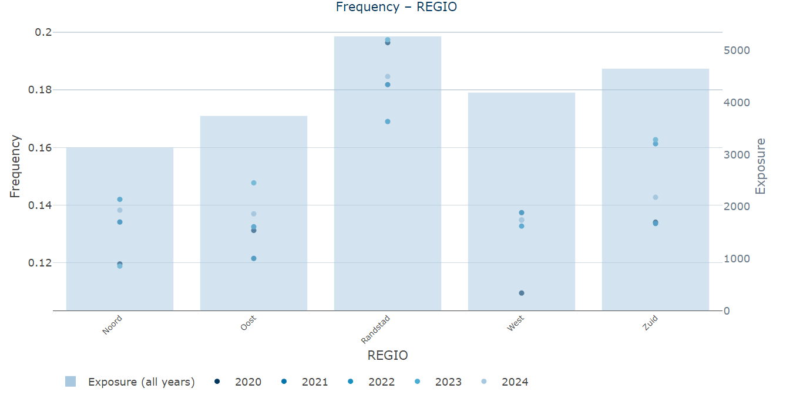

**Actual vs expected**, observed and predicted frequency per quantile bin
of a predictor, the core model-fit check:

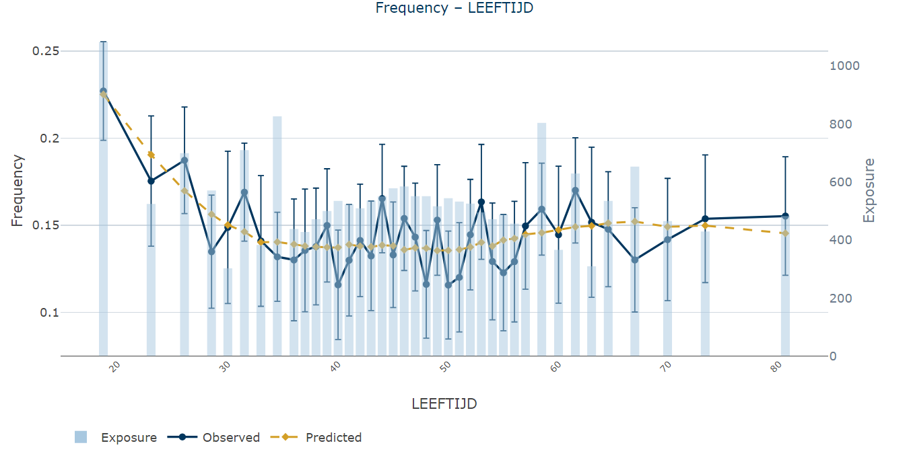

**Rating factors**, the multiplicative relativities that go into the
tariff, relative to the base level (dotted line at 1.0):

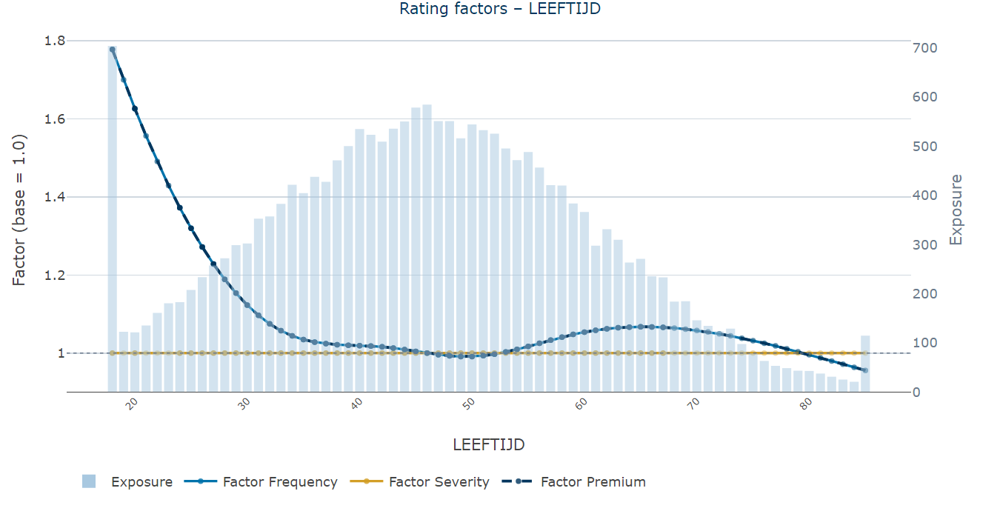

**Interactions**, one curve per level of the group variable; here young
drivers are materially worse in the Randstad than elsewhere:

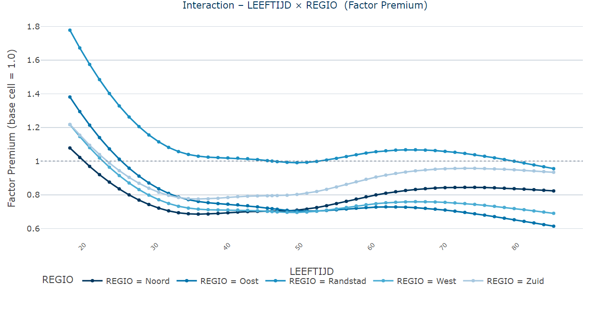

---

## Function reference

What each function does, how to call it and how to read its output. The
appendix carries the full technical specification: every argument, the
algorithm step by step, the exact return structure, the assumptions and the
cost. See the [appendix](#appendix-full-function-specification).

### `agg_all()`

Aggregates raw policy rows to one row per level of a grouping column
(optionally per accounting year), with frequency and severity computed on
the aggregate. This is the aggregation engine used internally by
`make_plot()`; call it directly when you want the summary table itself.

```r
agg_all(d, col, by_year,
        exposure_col = "Exposure", claims_col = "AantalClaims",
        loss_col = "SCHADELAST", year_col = "BOEKJAAR")
```

| Argument | Description |
|---|---|
| `d` | data.frame or data.table with raw rows |
| `col` | grouping column name (string) |
| `by_year` | `TRUE` = also split by accounting year |
| `*_col` | column-name overrides (see [Data conventions](#data-conventions)) |

**Returns** a data.frame with `col`, `[Year]`, `Exposure`, `ClaimCount`,
`Loss`, `Frequency` (`ClaimCount / Exposure`, `NA` when exposure ≤ 0) and
`Severity` (`Loss / ClaimCount`, `NA` when there are no claims).

Warnings are raised for `NA` values in the input columns and for groups with
non-positive exposure, so data-quality issues are visible instead of
silently averaged away.

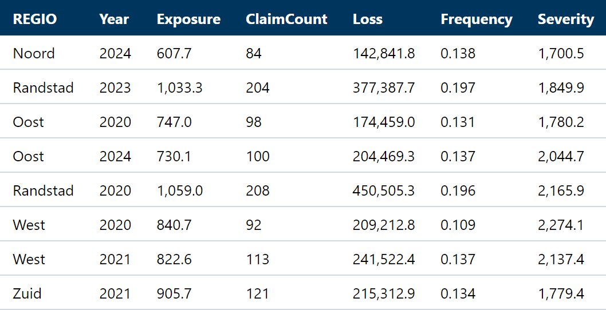

### `make_plot()`

One-way plot of frequency or severity with volume bars on a secondary axis.
Takes **raw policy rows** and aggregates internally via `agg_all()`.

```r
make_plot(data, col, metric = c("Frequency", "Severity"),
          color_single, y_label,
          display = c("color", "facet"), by_year, metric_fmt = 4,
          exposure_col = "Exposure", claims_col = "AantalClaims",
          loss_col = "SCHADELAST", year_col = "BOEKJAAR",
          discrete_cutoff = 25)
```

- `metric` selects what is plotted: `"Frequency"` (claims / exposure) or
  `"Severity"` (loss / claim), both computed on the internal aggregate.
- **The bars follow the metric's own denominator**: exposure under a
  frequency, the claim count under a severity. Those two routinely run in
  opposite directions, the level with the most exposure is often the one
  with the fewest claims, so exposure bars under a severity line would
  tell the reader the opposite of how solid each point is.
- `display = "color"`: one coloured line per year in a single panel
  (native plotly). Note: the bars then show the **sum over all
  years**, the trace is labelled "… (all years)" accordingly.
- `display = "facet"`: one panel per year (ggplot2 → ggplotly). The bars
  are rescaled per facet to the metric range; the tooltip shows true values.
- Categorical X-axes (and numeric columns with ≤ `discrete_cutoff` unique
  values) are drawn as markers only, so categories are never connected by a
  line.

**Returns** a plotly object.


### `make_pdp()`

**The question it answers:** *what does this one variable do to the price,
holding everything else where it is?*

```r
make_pdp(model, raw_data, pred_var,
         metric = c("Frequency", "Severity"),
         grid_res = 50, y_label = NULL, metric_fmt = 4,
         exposure_col = "Exposure", claims_col = "AantalClaims",
         loss_col = "SCHADELAST", discrete_cutoff = 25, y_range = NULL)
```

**What it does.** Take your whole portfolio and pretend, for a moment,
that every single policy is 30 years old. Price them all. Average the
result. Then do the same for 31, 32, and so on. Each point on the line is
"what this book would cost if everyone sat at this value", so the mix of
every *other* rating factor is identical at every point, and the line shows
the effect of age alone.

That is the difference from the observed line drawn beside it. The observed
line groups the policies that really are 30 years old, and those people also
differ in region, vehicle and everything else. The two lines answering
different questions is normal, not a sign of misfit.

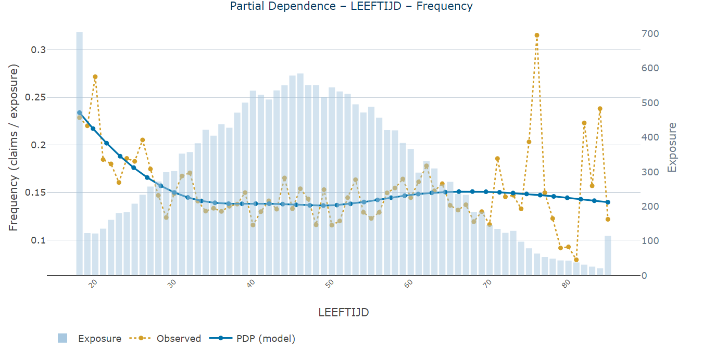

**Reading the chart:**

| Element | What it is |
|---|---|
| **Bars** | how much data sits at each value, exposure for frequency, claim count for severity. short bars mean a thin, unreliable stretch of the line |
| **Observed** (dotted) | what actually happened, per group, mix and all |
| **PDP (model)** (solid) | what the model says this variable does on its own |

The two lines running roughly parallel is the healthy picture. The PDP being
far flatter than the observed line usually means the variable is picking up
something another factor already explains. A PDP that jumps where the bars
are tiny is the model extrapolating, not a real effect.

Prices are always **per unit of exposure**, a full year, so a frequency of
0.12 means 12 claims per 100 policy-years, whatever the actual policy
durations are.

**Performance.** Policies that are identical on every *other* predictor
get the same answer, so they are collapsed into one before predicting. That
turns `grid_res × 1,000,000` predictions into `grid_res × 54,000` on a large
book, with a bit-for-bit identical result. If it is still slow, the number
of distinct combinations is the driver: band a very granular continuous
variable, or lower `grid_res`.

Full formula and the reason the averaging is arithmetic rather than
geometric: [`make_pdp()` specification](#make_pdp-specification).

### `plot_glm_predictor()`

Actual-vs-expected plot per predictor, computed on the model's own training
data.

```r
plot_glm_predictor(model, predictor, n_bins = 150,
                   weight_var = NULL, weight_label = NULL,
                   color = ta_year_palette(1), color_pred = ta_gold,
                   title = NULL, ylab = NULL, xlab = NULL,
                   metric_fmt = 4, bin_type = c("quantile", "width"),
                   exposure_col = "Exposure",
                   ci = TRUE, ci_level = 0.95, y_range = NULL)
```

Mode is detected automatically:

- **Offset model with log link** (typical frequency model): the response and
  predictions are counts; both are divided by the exposure recovered from
  `exp(offset)`, giving observed and predicted **frequency** per bin.
- **Otherwise** (typical severity model): the response is already an average;
  observed and predicted are **prior-weight-weighted means** per bin (e.g.
  claim-count-weighted for severity).
- `weight_var` overrides the weight column explicitly (must exist in
  `model$data`; an unknown name is an error, not silently ignored).

**More than one offset.** A model may carry a second, known relativity as
an offset next to the exposure — a bonus-malus scale that is given rather
than estimated:

```r
glm(AantalClaims ~ REGIO + offset(log(Exposure)) + offset(log(BM)), ...)
```

`exp(offset)` is then `Exposure × BM`, and dividing by it would put the
axis in claims per *BM-adjusted* policy-year, which is not a quantity
anyone reads off a chart. Both series are divided by `exposure_col`
instead, so the axis stays in claims per policy-year and the bars show
real exposure. The A/E is untouched by the choice, because both sides
divide by the same thing. `make_pdp()` weights its average by the same
column, so the two halves of that chart agree. With a single
`offset(log(Exposure))` nothing changes: the two are the same number.

The rating table handles the second offset the way you would want:
`.model_rate()` removes **both**, so the intercept and factors are the
base tariff *before* BM, and the premium chain becomes

```
premie = intercept × Π factoren × BM × Exposure
```

verified to reconstruct the model prediction exactly.

**Error bars.** The observed points carry a 95% interval by default, which
turns the plot from "these two lines differ" into "these two lines differ
by more than the noise here". A bin whose bar comfortably spans the
predicted line is not evidence of anything, however far apart the two
markers look, and a bar that is long simply says the bin is thin. Switch
them off with `ci = FALSE` or widen them with `ci_level`.

The interval is on the **observed** point only. The predicted line is the
model; its parameter uncertainty is a different and usually much smaller
quantity. The standard error comes from the fitted family's own variance
function, scaled by the Pearson dispersion where the family estimates one:
counts use `sqrt(φ·Σ V(μ)) / Σexposure`, weighted means the usual
`sqrt(φ·Σ w·V(μ)) / Σw`. Measured coverage on a correctly specified
Poisson is 0.96 for a binned continuous predictor and 0.98 for a
categorical one outside the model.

One case where the bars cannot be read as a test: for a **categorical term
that is in the model** under a canonical link, observed equals predicted at
every level by construction, so the bar always contains the predicted point
— coverage is 1 by identity, not by fit. The bar length still tells you how
much evidence the level carries, but the absence of a gap there is
arithmetic. That is the blind spot
[`detect_interactions()`](#detect_interactions) exists to cover; see [why a
one-way check cannot see an
interaction](#why-a-one-way-check-cannot-see-an-interaction).

**Binning.** A numeric predictor with at most `n_bins` distinct values is
not binned at all: every value gets its own point, on its exact position.
That matters for variables like vehicle age or number of claims, binning
would merge neighbouring values (ages 0 and 1 into one point at, say,
0.78) and, because equal-width bins span the observed range, a single
outlier would silently shift every point on the plot.

Only when there are more distinct values than `n_bins` does binning kick in:
**quantile bins** by default (each bin holds roughly the same number of
observations, avoiding noisy thin tails), or equal-width bins with `bin_type
= "width"`. A binned point then sits at the weight-weighted mean of the
values in its bin, not at the bin edge.

**Shared y-axis across variables.** By default the primary y-axis
auto-scales to the values of that one plot, so two predictors on very
different scales can look equally volatile. Pass `y_range = c(lo, hi)` to
pin the axis, and reuse the same value across predictors to make them
directly comparable:

```r
rng <- c(0, 0.55)
plot_glm_predictor(m_freq, "LEEFTIJD", y_range = rng)
plot_glm_predictor(m_freq, "REGIO",    y_range = rng)
```

| | |
|---|---|
| 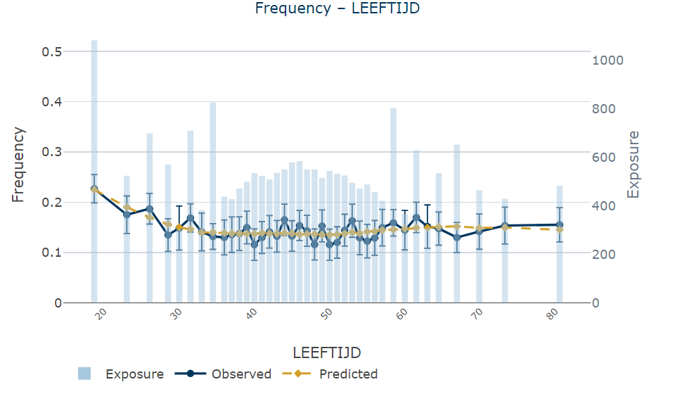 | 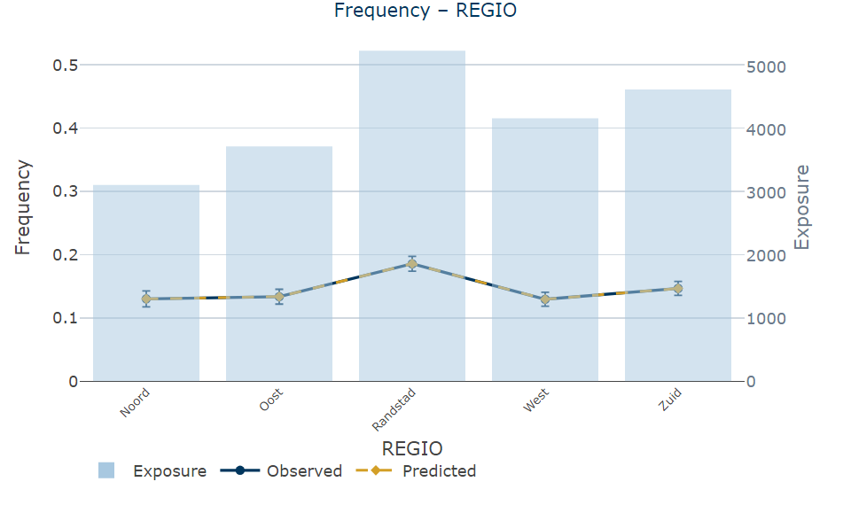 |

Both panels share one axis, so the age effect is visibly the stronger
driver. Note the trade-off: a shared axis flattens variables with a narrow
spread of their own, so use auto-scaling when inspecting one variable in
detail and a fixed range when comparing variables side by side.

`y_range` is available on every plotting function in the package
(`make_plot()`, `make_pdp()`, `make_rating_plot()`, `plot_glm_residuals()`,
and `premium_impact()`, which additionally takes an `x_range` for its change
axis). It is `NULL` everywhere by default, which keeps the usual
auto-scaling.

**Returns** a plotly object with weight bars, an "Observed" line and a
"Predicted" line.

### `glm_diagnostics()`

Compact fit summary for a frequency and/or severity model.

```r
glm_diagnostics(model_freq = NULL, model_sev = NULL)
```

**Returns** a data.frame with one row per model: `Model`, `Family`, `Link`,
`N`, `Deviance`, `DFResidual`, `AIC`, `Dispersion` (Pearson χ² / df) and
`DevianceExplained` (1 − deviance / null deviance, a pseudo-R²).

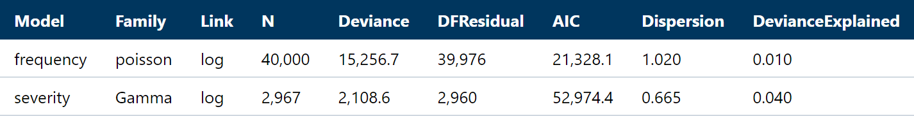

For Poisson/binomial families a **dispersion above 1.2 raises an
overdispersion warning**: the point estimates are still consistent, but
standard errors are understated, so consider a quasi-Poisson or negative
binomial family before reading anything into term significance.

### `glm_collinearity()`

**The question it answers:** *are two of my rating factors telling the
model the same thing?*

```r
glm_collinearity(model, threshold = 3)
```

**What it does.** If you put both vehicle weight and engine capacity in a
tariff, the model cannot tell which of the two is doing the work: they move
together. It will split the effect between them, and it can split it almost
arbitrarily: a big positive factor on one and a compensating negative one on
the other, giving the right total price for a nonsense pair of factors. This
function measures, for each term, how much of it the other terms already
explain.

**The number to read is `GVIF_scaled`.** It says how many times wider that
term's uncertainty is because of overlap with the rest:

| `GVIF_scaled` | Meaning |
|---|---|
| 1.0 | this term stands on its own |
| 2.0 | its factors are twice as uncertain as they would be alone |
| **3.0 or more** | flagged: the factors are not readable individually |

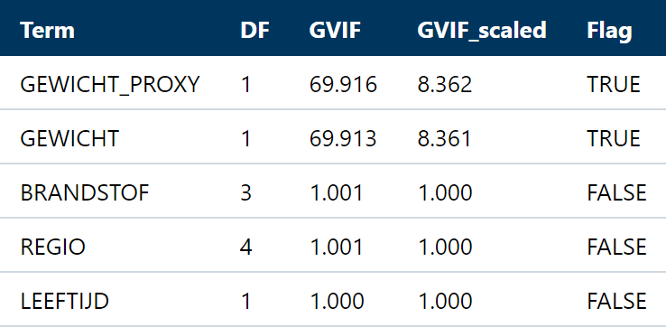

In this model two near-duplicate weight columns are flagged at 8.4, while
every independent term sits at 1.0.

**The most important thing about this diagnostic:** collinearity damages
**interpretation, not prediction**. The model's premiums can be perfectly
accurate while the individual factors behind them are meaningless. That
matters here because a rating table *is* an interpretation: you are
publishing those factors, so they have to mean something on their own.

The fix is usually to drop one of the pair, or combine them into a single
variable. Which one you keep is a business decision, not a statistical one;
the model has no preference.

> The counterpart of the near-duplicate warning in
> [`screen_features()`](#screen_features): that one catches correlated
> *candidates* before they go in, while this one catches them once both are in.

Why an ordinary VIF will not do here, and the generalised form used instead:
[`glm_collinearity()` specification](#glm_collinearity-specification).


> This is the model-level counterpart of the near-duplicate warning in
> [`screen_features()`](#screen_features): that one catches correlated
> *candidates* before they go in, while this one catches them once both are in.

### `plot_glm_residuals()`

Binned residual plot, the readable alternative to raw residual plots, which
are dominated by the 0/1 claim pattern on policy-level count data.

```r
plot_glm_residuals(model, predictor = NULL, n_bins = 50,
                   residual_type = c("pearson", "deviance"))
```

Residuals are averaged per quantile bin of the **fitted value** (default) or
of a **predictor** (`predictor = "AGE"`), and drawn together with a ±2·SE
band (scaled by the estimated dispersion). Under a correctly specified model
roughly 95% of the bin means should fall inside the band; a systematic
pattern outside it (e.g. a curve over a predictor) signals missed structure,
a candidate spline, banding or interaction. Categorical predictors get error
bars per level instead of a ribbon.

The bin means are drawn as **points, not joined into a line**. They are
independent draws, and a connecting line invites the eye to trace a trend
through what is mostly noise; the band is what says whether a point means
anything.

**Returns** a plotly object.

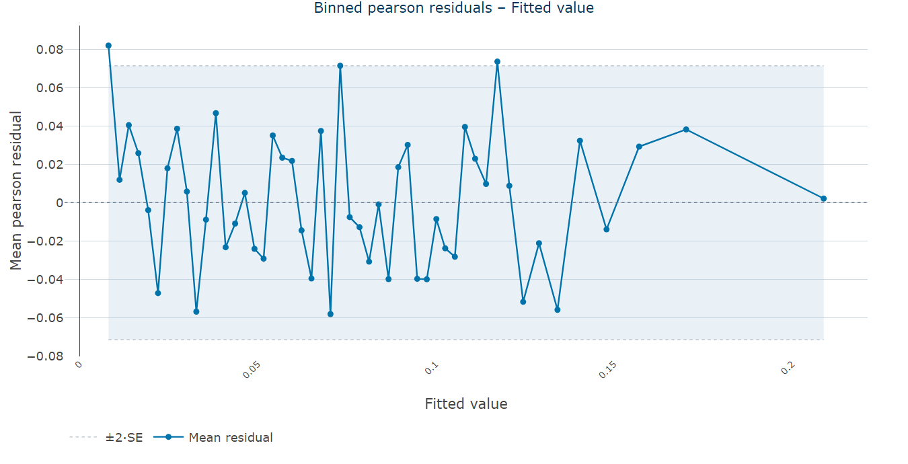

### `plot_glm_qq()`

**The question it answers:** *the model gets the average right, but does
it get the spread right?*

```r
plot_glm_qq(model, n_max = 5000, band = TRUE, seed = NULL,
            title = NULL, y_range = NULL)
```

**Why you would care.** A model can predict an average claim of €2,000 and
be right on average, while being completely wrong about how claims are
spread around that. If real losses have a much fatter tail than the model
assumes, every premium is fine on average and the capital you hold behind
them is not. Every other plot in this package checks the average. This one
checks the shape.

**What it does.** For each policy it asks: *given what the model predicted
for you, how extreme was your actual outcome?* A policy at the model's 90th
percentile scores 90%. Do that for everyone and, if the model has the shape
right, those scores should be spread perfectly evenly from 0 to 100%. The
plot converts them to a scale where "perfectly even" is a straight diagonal
line.

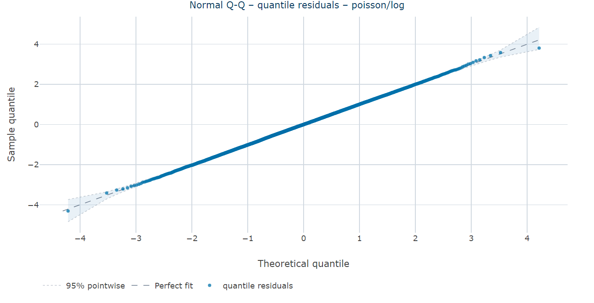

**Reading the chart:**

| What you see | What it means |
|---|---|
| Points on the diagonal | the family fits, nothing to do |
| Ends curling **up on the right, down on the left** | real outcomes are more extreme than assumed; the tail is fatter than the model thinks |
| Ends bending **towards the middle** | the model assumes more spread than there is |
| An S-shape on a frequency model | over- or underdispersion, the same message [`glm_diagnostics()`](#glm_diagnostics) gives as a number |
| A curving upper tail on a Gamma severity | large losses are heavier than Gamma allows; consider a log-normal, or capping |

The shaded band is where points may fall by chance. It is *pointwise*, so
with several thousand points a handful will always sit outside it even when
the model is right. **Read the shape of the curve, don't count the
exceptions.**

**One thing to know before you trust the standard version.** R's own
`plot(model)` draws this chart too, and for claim counts it is unusable: it
rejects models that are exactly correct. Measured on a Poisson that was
right by construction, 20,000 rows and 87% of them claim-free:

| Method | points outside the band (should be 5%) | verdict on a correct model |
|---|---|---|
| base R `plot(model)` | 8.3% | rejected |
| `boot::glm.diag.plots()` | 1.3% | rejected |
| **this function** | **5.1%** | **accepted** |

The reason is that claim counts are whole numbers, mostly zero, and the
classical residuals were built for continuous data. This function uses
**quantile residuals** (Dunn & Smyth, 1996), which handle that correctly.
The randomisation involved means two calls give slightly different pictures,
pass `seed` if you need the same one twice.

Verified against `statmod::qresid()`, the reference implementation:
identical for Poisson, equal to 6e-14 for Gamma. The mathematics, the
per-family formulas and the comparison with `DHARMa`'s simulated envelope:
[reading a Q-Q plot](#reading-a-q-q-plot-of-quantile-residuals) and the
[specification](#plot_glm_qq-specification).

### `plot_glm_influence()`

**The question it answers:** *is one odd policy pulling my whole tariff
around?*

```r
plot_glm_influence(model, n_label = 10, data_cols = NULL, n_max = 5000,
                   max_rows = 2e5, seed = NULL, title = NULL,
                   y_range = NULL)
```

**What it does.** A model fits every policy at once, but not every policy
gets an equal vote. One record with a vehicle weight of 20 tonnes, because
someone typed kilograms where tonnes were meant, can bend a whole curve
towards itself. This plot finds the records with the loudest votes and shows
you *why* each one is loud.

The chart has two axes, and the combination is the point:

- **Left to right, how unusual the policy is.** Far right means its
  rating factors are unlike anything else in the book.
- **Up and down, how badly the model fits it.** Far from the middle line
  means the actual outcome was nothing like the predicted one.
- **Bubble size, how much the fit actually moves** because of it.

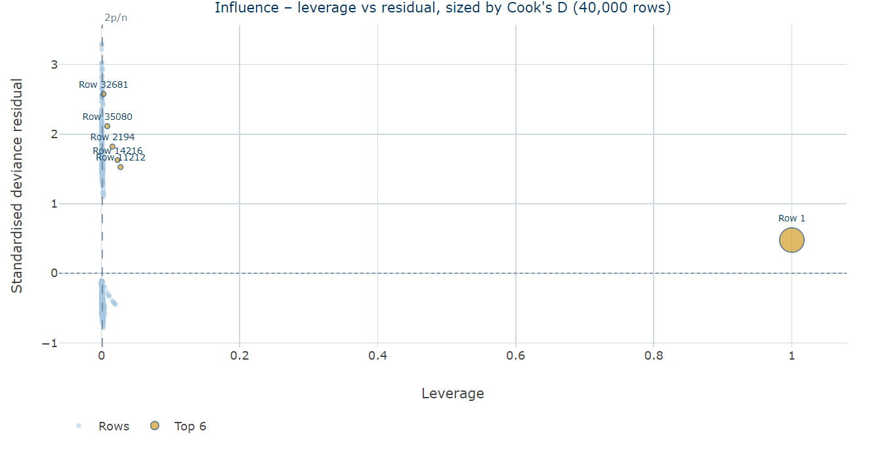

The big bubble on the far right is the 20-tonne car. Note where it sits
vertically: almost on the zero line, i.e. **apparently well fitted**. That
is the trap this plot exists to expose, a record that unusual drags the
model towards itself until its own residual looks innocent. It hides from
every residual check while quietly distorting the curve for everyone else.

The `n_label` strongest records come back as a table you can act on:

```r
p <- plot_glm_influence(m_freq, n_label = 10)
attr(p, "influential")     # row number, actual, fitted, and your own variables
```

**Two things this plot is not.**

It is a **ranking, not a test**. On 100,000 policies no single record swings
a coefficient much, and the textbook thresholds are useless at that size, `D
> 1` never fires, `D > 4/n` flags thousands of ordinary rows. So it tells
you which records are the most influential *relative to each other*, and you
go and look at them.

And it is **not a misfit check**. The two are not the same thing, and on a
frequency model they can be opposites: a policy with an exposure of 0.001
that has a claim is the worst-fitted record in your book and is completely
invisible here, because a sliver of exposure carries almost no weight in the
fit. Use [`plot_glm_qq()`](#plot_glm_qq) or
[`plot_glm_residuals()`](#plot_glm_residuals) to catch that half.

Both points, with the measurements behind them: [Cook's distance on a large
book](#cooks-distance-on-a-large-book).

**Returns** a plotly object, with the top rows attached as the
`"influential"` attribute.


### `detect_interactions()`

Scans every two-way combination of variables and ranks them by the
interaction structure the GLM has not captured.

```r
detect_interactions(model, vars = NULL, n_bins = 10, min_claims = 30,
                    n_sim = 200, top_n = NULL, seed = NULL)
```

For each pair it builds the two-way table of actual versus expected claims,
matches the row and column margins by **iterative proportional fitting**, so
main-effect misfit (a spline needing another knot, a level that is simply
mispriced) is scaled away first, and takes the remaining deviance as the
statistic. That is the likelihood-ratio test between the additive and the
saturated model on the table.

Because that deviance is unreliable in sparse tables, the reference
distribution comes from **simulation** rather than chi-square asymptotics
whenever the model is a Poisson count model: claims are resampled from the
raked expected values under the additive null, `n_sim` times. Other families
fall back to the dispersion-scaled chi-square (reported in the `Method`
column).

`vars` defaults to the model's own predictors, but you can pass variables
that are *not* in the model, which is how a completely omitted rating factor
surfaces.

**Returns** a data.frame, strongest first: `VarX`, `VarY`, `Cells`,
`Claims`, `Deviance`, `DF`, `Z`, `P`, `Method`, `MaxAE`, `MaxAE_Claims`,
`MaxAE_ExposureShare`.

On the portfolio that is missing an age × region interaction, the true pair
comes out at `Z = 33.9` against 1.6 for the runner-up, and its worst cell is
27% mispriced on 3% of the exposure:


> The ranking is by statistical signal (`Z`), which is not the same as
> materiality. Judge the two separately: `MaxAE` is the A/E of the worst
> cell that has enough claims, and `MaxAE_ExposureShare` says how much of
> the portfolio sits in it.

### `plot_residual_heatmap()`

The A/E ratio per cell of two variables, the view that shows *where* a model
leaks.

```r
plot_residual_heatmap(model, var_x, var_y, n_bins = 20,
                      min_claims = 30, z_range = NULL, title = NULL)
```

Below, a frequency GLM with clean main effects for age and region but no
interaction between them. Young drivers in the city are underpriced by 27%
while the same age group elsewhere is overpriced, and every one-way check on
this model is spotless:

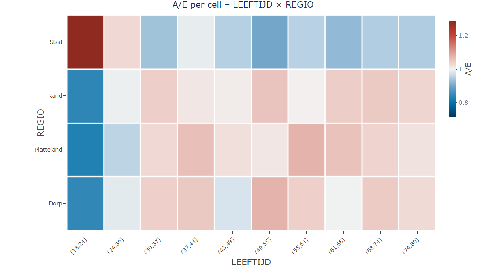

- Values come from the model's own rows, so they always align with the
  fitted values; both variables must be columns of the data the model was
  fitted on.
- The colour scale is **diverging around 1.0**, blue overpriced, red
  underpriced, neutral grey at break-even. `z_range` fixes it across
  several heatmaps.
- Cells with fewer than `min_claims` claims are **left blank and marked
  with a grey cross** rather than coloured: in a thin cell the A/E is
  mostly noise, and colouring it would make it the loudest thing on the
  plot. Their volume is still in the tooltip.
- The cell table (groups, actual, expected, A/E, exposure, claims, thin
  flag) is attached to the returned plot as the `"cells"` attribute.

### `screen_features()`

Fits a boosted challenger with the GLM as an offset, so it can only model
what the GLM leaves behind. Requires `xgboost` (in `Suggests`).

```r
screen_features(model, features = NULL, split = c(0.6, 0.2, 0.2),
                max_depth = 2, eta = 0.05, nrounds = 2000,
                early_stopping_rounds = 40, n_shap = 4000,
                cor_threshold = 0.95, max_levels = 50, seed = NULL)
```

The baseline you pass decides which question it answers. With a **minimal
model** it screens candidates *before* you choose what goes into the tariff,
"what does this data add on top of what I already price on". With your
**full model** it asks what the finished tariff still misses. The baseline
is refitted on the training split, so both sides of the comparison are out
of sample. No scorable model is returned.

```
$summary
                                     Stage Deviance Change
                              baseline GLM    16720
        + booster, depth 1 (additive only)    16650 -0.41%
 + booster, depth 2 (may use interactions)    16653 +0.02%

$features
       Feature InModel PermDeviance   Gain
   KILOMETRAGE   FALSE        66.83 0.4291
       GEWICHT   FALSE        16.78 0.1460
 GEWICHT_PROXY   FALSE        14.21 0.2058
         KLEUR   FALSE         3.04 0.0414
      LEEFTIJD    TRUE         0.64 0.0381
         REGIO    TRUE        -0.14 0.0045
          RUIS   FALSE        -3.57 0.1351
```

Three things to read carefully:

- **The verdict is staged.** While the depth-1 step still improves the
  fit, main effects are missing and the interaction ranking cannot be
  trusted. Fix the main effects, then run again.
- **Rank on `PermDeviance`, not `Gain`.** `PermDeviance` is the increase
  in out-of-sample deviance when the feature is shuffled with the baseline
  held fixed, so it is the *incremental* contribution; at or below zero
  means no usable signal. `Gain` is biased towards continuous and
  high-cardinality features, in the run above it gives pure noise
  (`RUIS`) a 13.5% share while the permutation test correctly puts it at
  −3.57.
- **Near-duplicates split their importance.** `GEWICHT` and
  `GEWICHT_PROXY` each get roughly half, and which one comes out on top is
  arbitrary. Pairs above `cor_threshold` are listed in `$correlated` with
  a warning.

Also returns `$interactions` (SHAP ranking), `$stats` and `$plot`. The plot
ranks candidates by incremental value, muting everything at or below zero,
the columns that carry no signal:

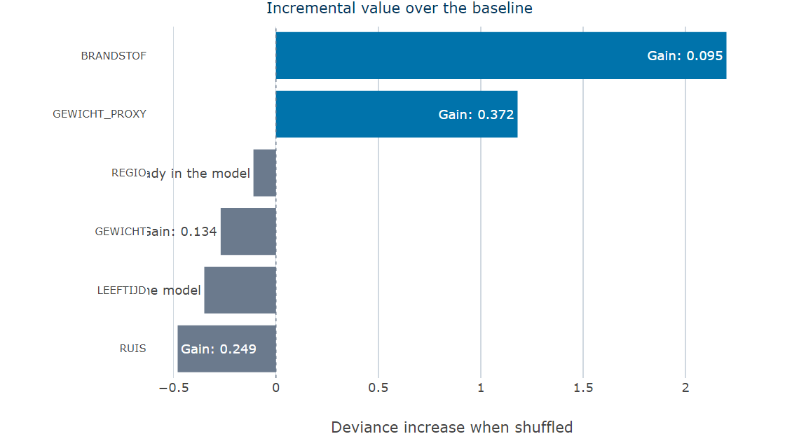

> **Sensitivity.** A booster is *less* sensitive to a two-way interaction
> between known rating factors than
> [`detect_interactions()`](#detect_interactions): the cell-based test
> concentrates the signal into one statistic with a known null, while the
> booster must discover the split structure and pays a variance cost for
> its flexibility. On the same data, a case where the cell test reaches
> Z = 7.7 can leave the booster reporting nothing at all. Use this
> function to screen features and for the global verdict; use
> `detect_interactions()` to hunt interactions.

### `make_rating_table()`

**The question it answers:** *turn my two models into a price list I can
hand to someone.*

**What it does.** A GLM is a formula on a log scale, not something you can
put in a tariff document. This turns it into the multiplicative table
insurers actually quote from: **one base premium, and one factor per
variable that you multiply onto it.**

```
              base premium                       € 312
  age 24      × 1.41
  region Stad             × 1.22
  fuel diesel                       × 0.94
                                            = € 504
```

Every factor says the same thing: *how many times more expensive than the
base case is this level?* A factor of 1.41 is 41% more expensive, 0.94 is 6%
cheaper, and the base level is 1.00 by definition. Multiply the base premium
by one factor per variable and you get exactly what the model predicts,
verified to machine precision, not approximately.

**The base case** is the policy every factor is measured against: the first
level of each categorical variable (or the largest by exposure, with
`base_level = "exposure"`) and the median of each continuous one. It is a
reference point, not a recommendation, moving it changes every factor and
the base premium together, and leaves all quoted prices identical.

```r
make_rating_table(model_freq = NULL, model_sev = NULL, data,
                  grid_res = 50,
                  exposure_col = "Exposure", claims_col = "AantalClaims",
                  base_level = c("first", "exposure"),
                  trim = c(0, 1),
                  min_claims = 30, grid_step = NULL)
```

| Argument | Description |
|---|---|
| `model_freq`, `model_sev` | fitted glm objects (at least one; log link expected) |
| `data` | original dataset, used for base values, grids and exposure |
| `grid_res` | target number of grid points for continuous variables |
| `grid_step` | step size for continuous grids; `NULL` picks a readable one, see [Readable grids](#readable-grids-for-continuous-variables) |
| `base_level` | `"first"` = first factor level is the reference; `"exposure"` = the level with the largest exposure is the reference |
| `trim` | quantile range for continuous grids, e.g. `c(0.005, 0.995)` to avoid outlier tails and spline extrapolation |
| `min_claims` | thin-cell threshold: levels with fewer claims get `IsThin = TRUE` (categorical thin levels also raise a warning) |

**Returns** a data.frame with one row per level/grid point per variable:

| Column | Meaning |
|---|---|
| `Variable` | variable name, or `"A:B"` for an interaction |
| `Type` | `"categorical"` / `"continuous"` (of the X variable) |
| `Level`, `LevelNum` | level as text and (when applicable) numeric |
| `Group`, `GroupVar`, `XVar` | interaction bookkeeping (`NA` for main effects) |
| `IsBase` | `TRUE` on the base row/cell (factor exactly 1) |
| `Exposure`, `ClaimCount` | data volume per level, and per cell for interactions, a continuous variable is binned onto its own grid first, so the cells are filled whatever the two types are |
| `Factor_Frequency`, `Factor_Severity`, `Factor_Premium` | the multipliers themselves, how many times the base. `Premium = Frequency × Severity`. A variable that is in only one of the two models gets 1.00 in the other |
| `Uplift_Frequency`, `Uplift_Severity`, `Uplift_Premium` | interaction rows only, the part the two main effects do **not** already explain. See below |
| `IsThin` | `TRUE` when `ClaimCount < min_claims`: this factor rests on very few claims and is correspondingly unstable. Dimmed in `make_rating_plot()`, greyed out in the Excel export, see [Thin cells](#thin-cells) |

#### Factor vs Uplift on an interaction row

This is the one column that trips people up, so here it is concretely.
Suppose young drivers cost 1.40× the base, city drivers 1.20×, and you have
both:

| | Meaning | Young **and** city |
|---|---|---|
| main effect, age | how much more a young driver costs | 1.40 |
| main effect, region | how much more a city driver costs | 1.20 |
| **`Factor_*`** | what the model charges this **combination**, all in | 1.85 |
| **`Uplift_*`** | what the combination costs **on top of** the two separately | 1.85 ÷ (1.40 × 1.20) = **1.10** |

So `Factor` is the price and `Uplift` is the surprise. The two main effects
would have predicted 1.68; the model says 1.85; the extra 10% is the
interaction, being young *in the city* is worse than being young and being
in the city added together.

Read them for different purposes:

- **`Factor_*`** is what you put in the tariff. It already contains
  everything.
- **`Uplift_*`** is what you look at to decide whether the interaction is
  worth having at all. **An uplift of 1.00 everywhere means there is no
  interaction**, the two variables are simply additive on the log scale
  and the term is buying you nothing. Uplifts scattered between 0.97 and
  1.03 are noise. Uplifts that run in a clear direction, like 1.20 for the
  young in the city falling to 0.95 for the old in the country, are a real
  effect.

Never multiply the uplift onto the main effects yourself: that would
double-count, because `Factor` already includes it.

#### Readable grids for continuous variables

A tariff lists ages 18, 19, 20 and weights 800, 850, 900, not 19.2653 and
832.65. The grid therefore runs in steps you would quote, chosen per
variable:

1. a whole-number column with at most `2 × grid_res` distinct values is
   listed **on those values**, which is what gives an age per year, and
   what keeps a coded column such as a sum insured, five values spread
   over a million, to five rows;
2. otherwise take the (trimmed) range and aim at roughly `grid_res`
   points;
3. round that raw step to a 1, 2 or 5 times a power of ten, the way an
   axis picks its ticks.

A stepped grid is then laid on whole multiples of the step, so the numbers
read as round values rather than as an offset sequence. On the demo
portfolio that gives:

| Variable | Range | Step | Points |
|---|---|---|---|
| `LEEFTIJD` | 18–80 | every value | 63 |
| `GEWICHT` | 800–2400 | 50 | 33 |
| `KILOMETRAGE` | 2000–86000 | 2000 | 43 |

Rule 1 works off the values, never off a step of 1 across the range. That
distinction is the difference between a five-row grid and a million-row one
for a column whose codes happen to be far apart.

Set your own with `grid_step`, as one number for everything or per variable,
as a vector or a list:

```r
make_rating_table(m_freq, m_sev, data = dat,
                  grid_step = list(LEEFTIJD = 1, GEWICHT = 100))
```

Naming only some variables is fine, the rest keep the automatic step. A name
that matches no continuous variable is reported rather than silently
ignored, so a typo does not leave you thinking you set a step you did not.

Two things the step does *not* know about. It is driven by the **range**, so
a single outlier coarsens the grid for everyone, which is what `trim` is
for, and trimming happens before the step is chosen. And it is not density-
or curvature-aware: a spline that bends sharply at young ages gets the same
resolution as the flat stretch above 40.

**Offsets and the base point.** Every variable the model offsets on is held
at 1 in the base row, and the offset the model actually carries is then
subtracted on the link scale, so `intercept × factors` is a rate per unit of
exposure whatever that column is called and whatever form the offset takes,
see [deriving the offset and the link](#deriving-the-offset-and-the-link).
The factors themselves are ratios of two predictions that share the base
row, so the offset cancels there either way; the intercept is the one number
that carries it. If the offset variable differs from `exposure_col`, the
intercepts are still correct but the `Exposure` and `ClaimCount` columns are
summed from a different column, and the function warns.

**Rows outside the grid.** With `trim`, policies beyond the trimmed range
are excluded from the exposure histogram rather than swept into the outer
bins. The exposure shown therefore adds up to less than the portfolio total,
by design, since the grid does not cover those policies.

Attributes on the returned table:

- `intercept_frequency`, `intercept_severity`, `intercept_premium`: the
  model prediction at the base point, **per unit of exposure**;
- `base_values`, named list with the base value used per variable.

Inline formula transformations such as `factor(YEAR)` and `ns(AGE, 4)` are
resolved to their underlying columns; terms whose base variable cannot be
found in `data` are skipped with a warning rather than crashing the call.

The rows for one categorical variable look like this (base row highlighted,
thin row greyed out, as in the Excel export). Note the last level: 5 claims
behind a premium factor of 1.22, so that factor is essentially noise,
exactly what the `IsThin` flag is there to surface:

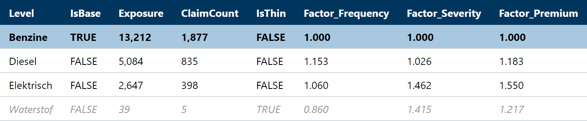

### `make_rating_plot()`

Plots one variable (or interaction) from a rating table.

```r
make_rating_plot(rating_tbl, var, metric_fmt = 4, metric = NULL,
                 y_range = NULL)
```

- **Main effects**: factor curves for Frequency, Severity and Premium on the
  primary axis (with a dotted reference line at 1.0), exposure bars on the
  secondary axis.
- **Interactions** (`var = "A:B"`): one series per level of the group
  variable. Shows one metric at a time, `metric` picks
  `"Frequency"`, `"Severity"` or `"Premium"` (default: Premium when both
  models are present). Exposure bars are included for categorical ×
  categorical interactions.
- **Thin cells**: levels flagged `IsThin` in the rating table are drawn with
  dimmed markers and a "low claim volume" note in the tooltip, so factors
  built on few claims are visually distinct from well-supported ones.

**Returns** a plotly object.

The same variable as the table above, markers only (categories are never
connected by a line), with the thin level's markers faded:

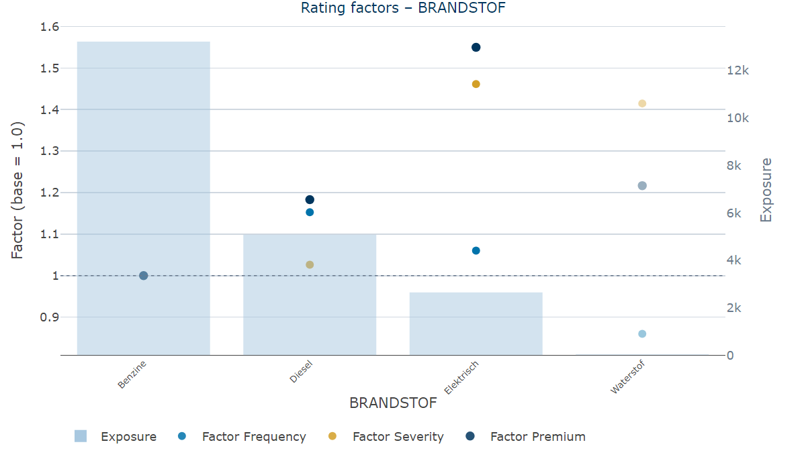

For a continuous variable and an interaction, see the [Gallery](#gallery).

### `model_lift()`

**The question it answers:** *does my model actually tell cheap risks from
expensive ones?*

```r
model_lift(model_freq = NULL, model_sev = NULL, data = NULL,
           actual_col = "SCHADELAST", exposure_col = "Exposure",
           claims_col = "AantalClaims", weight_col = NULL,
           n_bins = 10, y_range = NULL)
```

**What it does.** Every other diagnostic here looks at one variable. This
one judges the model as a whole, in three steps:

1. Price the entire book and sort it from cheapest to most expensive.
2. Cut it into 10 slices, each holding the **same amount of exposure**,
   so slice 1 is the tenth of the book the model thinks is safest, and
   slice 10 the tenth it thinks is worst.
3. In each slice, compare what the model predicted with what actually
   happened.

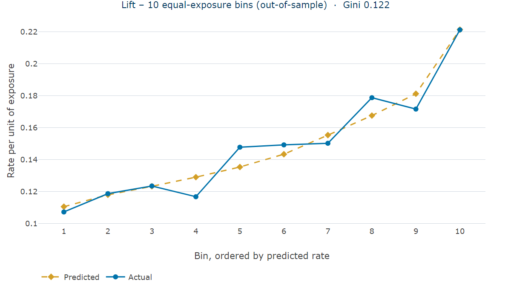

**Reading the chart.** The gold line is what the model predicted, the blue
line what really happened.

- **Does the blue line rise?** That is the whole point. If policies the
  model called risky really did cost more, the model separates risk. A
  flat blue line means the model orders nothing, however good its overall
  average is.
- **Do the two lines sit on top of each other?** Then it is also
  *calibrated*, right about how much, not just about the order. A blue
  line that rises but sits above the gold one at both ends means the model
  under-differentiates: it has the ranking right but is too timid about it.

**The numbers behind the chart** are in `$table`, one row per slice:

| Column | What it tells you |
|---|---|
| `Bin` | 1 = the tenth the model thinks is safest, 10 = the worst |
| `Exposure`, `ExposureShare` | how much book is in the slice, should be ≈ 0.10 each by construction |
| `ActualRate` | what the slice really cost, per unit of exposure |
| `PredictedRate` | what the model said it would cost |
| `AE` | `ActualRate / PredictedRate`. **1.00 is perfect.** 1.15 means that slice cost 15% more than priced; 0.90 means 10% less |

`AE` is the column to scan. A run of values above 1 at one end and below 1
at the other is a systematic problem, not noise, and it tells you *where*
the tariff is wrong, which is something a single summary number never does.

**The Gini** compresses the ranking into one number between 0 and 1: 0
means the model separates nothing, higher means it separates better. It
measures **ordering only**, a model can have an excellent Gini and be badly
calibrated, which is exactly what the `AE` column reveals. Use it to compare
candidate models on the same book; do not read an absolute value as good or
bad, because it depends heavily on how heterogeneous the book is.
`plot_lorenz` draws the curve it comes from, the further it bows from the
diagonal, the more the model separates:

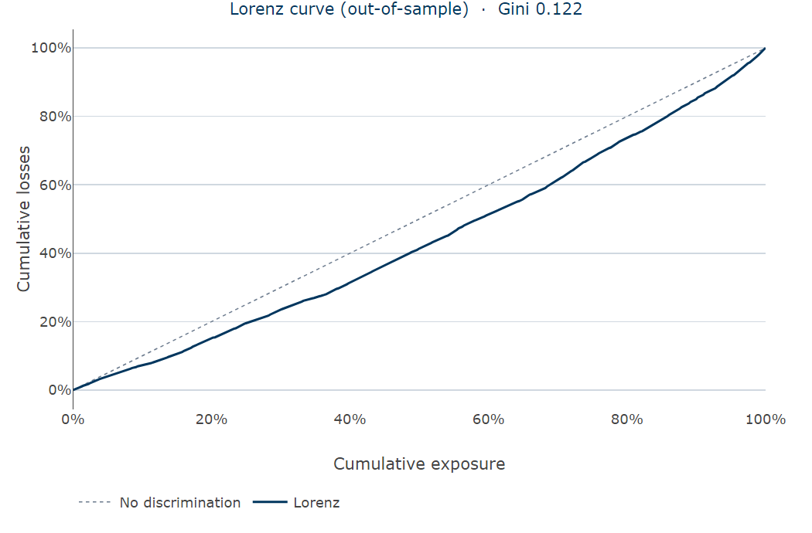

> **Match the units.** Claim counts with a frequency model, loss amounts
> with a severity or risk premium model. If the overall A/E lands far from
> 1 the function warns, because that nearly always means `actual_col` and
> the prediction are different quantities.

> `data = NULL` scores the model on the rows it was fitted to, flattering,
> and labelled *(in-sample)* on the chart. Pass a holdout for an honest
> answer.

### `double_lift()`

Which of two tariffs is right where they disagree.

```r
double_lift(data, model_freq_new = NULL, model_sev_new = NULL,
            model_freq_old = NULL, model_sev_old = NULL,
            old_premium_col = NULL,
            old_premium_basis = c("amount", "rate"),
            actual_col = "SCHADELAST", exposure_col = "Exposure",
            n_bins = 10, rebase = TRUE, y_range = NULL)
```

**The question it answers:** *my new tariff and my old one disagree about
some policies, which of them is right?*

**Why a single lift chart cannot answer this.** Two tariffs can both look
convincing on their own lift charts and still price the same policy €400
apart. Their averages hide it. What settles the argument is looking only at
the policies where they disagree, and asking which one the claims sided
with.

**What it does.** For every policy, work out `new price ÷ old price`. Sort
the book by that ratio and cut it into 10 slices. Slice 1 holds the policies
where the new tariff is most *below* the old one; slice 10 where it is most
*above*. The middle slices are where the two roughly agree, uninteresting by
design. Then plot how each tariff did in each slice.

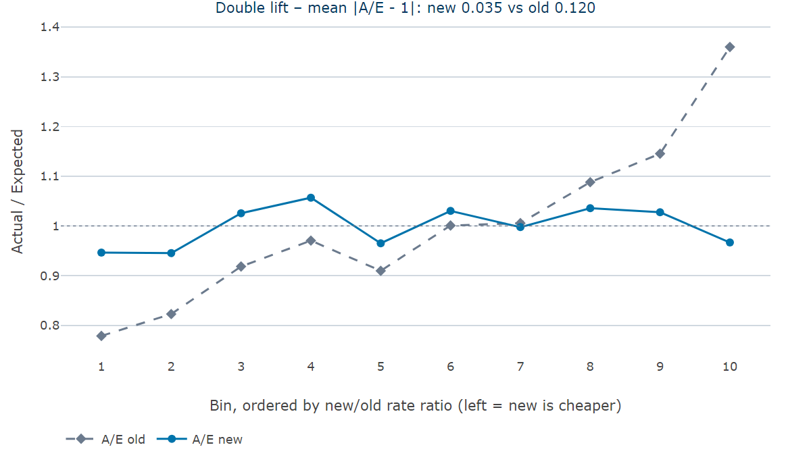

**Reading the chart.** Both lines show A/E, actual over expected, so
**1.0 is right and the reference line is the target.**

- **Look at the ends, not the middle.** That is where the tariffs disagree
  and where the comparison is decided.
- **The line that stays closer to 1.0 across the range is the better
  tariff.** In the figure the old tariff drifts from 0.78 to 1.36: it was
  charging 22% too little at one end and 36% too much at the other,
  exactly where it disagreed with the candidate. The candidate stays near
  1.0, so the disagreements were the candidate being right.
- **A line above 1.0** means that tariff under-charged those policies;
  **below 1.0** means it over-charged them.

**The numbers behind the chart**, in `$table`:

| Column | What it tells you |
|---|---|
| `Bin` | 1 = new tariff is cheapest relative to old, 10 = most expensive |
| `RateRatio` | the average `new ÷ old` in that slice, 0.85 means the new tariff is 15% cheaper for those policies |
| `ActualRate` | what those policies really cost |
| `AE_New`, `AE_Old` | each tariff's actual-over-expected. **The comparison is between these two columns, row by row** |

And in `$stats`:

| Value | What it tells you |
|---|---|
| `mad_new`, `mad_old` | average distance from 1.0 across the slices, lower is better calibrated |
| `winner` | `"new"`, `"old"` or `"tie"`, from those two |
| `rate_level_change` | how much more the new tariff collects overall, measured before any rebasing |

Treat `winner` as a headline, not a verdict: it is an average of the
picture, and *where* a tariff drifts matters as much as how far.

**Rate level is taken out by default** (`rebase = TRUE`), so both sides
collect the same total premium and the chart is purely about
differentiation. Whether the new tariff should collect more in total is a
separate, commercial question, `rate_level_change` reports it either way,
and [`premium_impact()`](#premium_impact) is where that conversation
belongs.

```r
double_lift(data, model_freq_new = NULL, model_sev_new = NULL,
            model_freq_old = NULL, model_sev_old = NULL,
            old_premium_col = NULL,
            old_premium_basis = c("amount", "rate"),
            actual_col = "SCHADELAST", exposure_col = "Exposure",
            n_bins = 10, rebase = TRUE, y_range = NULL)
```

Same arguments as [`premium_impact()`](#premium_impact): either two model
sets, or one model set and a column holding your current premium.

### `premium_impact()`

Dislocation analysis: per-policy comparison of premiums under a new model
set against old models or an existing premium column.

```r
premium_impact(data,
               model_freq_new = NULL, model_sev_new = NULL,
               model_freq_old = NULL, model_sev_old = NULL,
               old_premium_col = NULL,
               old_premium_basis = c("amount", "rate"),
               rebase = TRUE, by = NULL, n_show = 10,
               exposure_col = "Exposure", spotlight = NULL,
               x_range = NULL, y_range = NULL)
```

Premiums are computed as **rates per unit of exposure** (offsets neutralised
at exposure = 1); the premium is the product of the models supplied. The old
side is either a model pair or `old_premium_col`, a column with the current
premium, interpreted as an amount for the record (`"amount"`, divided by
exposure internally) or as a rate (`"rate"`).

With `rebase = TRUE` (default) the new premiums are scaled so the
exposure-weighted totals match the old ones. That separates the two
questions a dislocation analysis answers: the overall **rate-level change**
(reported in the summary) and the **redistribution** across the portfolio
(the histogram and quantiles).

**Returns** a list: `summary` (display table), `stats` (the same numbers as
a named list), `policy` (per-row old/new/percent change), `by_level`
(exposure-weighted mean change per level of the `by` columns),
`largest_increases`/`largest_decreases` (top-`n_show` dislocations) and
`plot` (exposure-weighted histogram of premium changes with the median
marked).

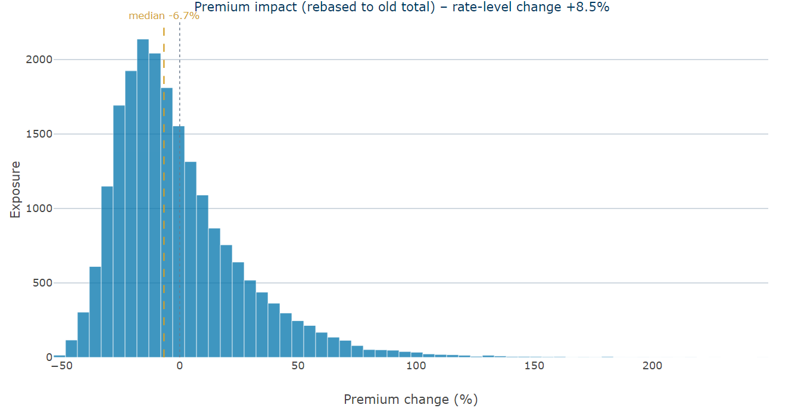

**Who drives the change.** With `by`, each level gets `ExposureShare`,
`MeanChangePct` and `Contribution = share × change`. The contributions of
one variable's levels **sum to the portfolio change**, which answers the
question a pricing committee actually asks: not "how much does this segment
move" but "how much of our +10.5% comes from it".

**Spotlighting a subset.** `spotlight` takes an expression evaluated
against `data`, or a logical vector:

```r
imp <- premium_impact(dat, model_freq_new = m_freq, model_sev_new = m_sev,
                      old_premium_col = "PREMIUM",
                      spotlight = REGION == "City" & AGE < 25)
imp$spotlight$summary
```

It is deliberately a **spotlight and not a filter**: the whole book is still
analysed, the subset appears as a second series on the histogram, and
`$spotlight` reports its exposure share, mean and median change, and its
contribution to the portfolio total. Filtering would remove exactly the
context you need: that a segment moves +18% while the book moves +2%.

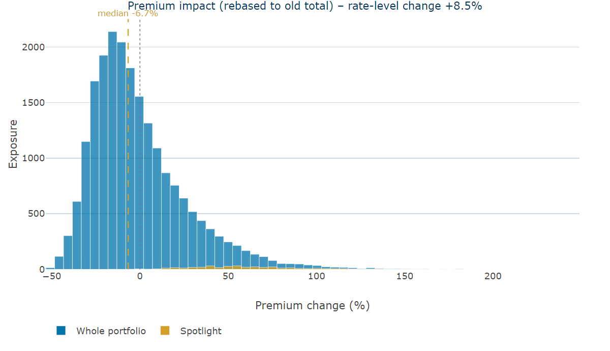

Its statistics are computed **after** the book-level rebase, because the
rebase is a decision about the whole portfolio. Rebasing within the subset
would force every segment to average out at zero and tell you nothing.

> **No mix effect here.** Old and new premiums are compared on the *same*
> policies, so the portfolio composition is identical on both sides and
> there is nothing to decompose into rate versus mix. `Contribution`
> answers which segment drives the change, not how much of it is mix. A
> genuine mix-shift analysis needs two portfolio snapshots and is a
> different calculation.

### `export_rating_table()`

Formatted Excel export of a `make_rating_table()` result (requires
`openxlsx`).

```r
export_rating_table(rating_tbl, file = "rating_table.xlsx",
                    overwrite = TRUE, digits = 4)
```

The workbook contains:

- **Overview**, timestamp, the intercepts (per unit of exposure) and the
  base value per variable;
- **Tariff**, every factor of every variable under one another with a
  single `Key` column (`Variable|Level`, plus the group for interaction
  rows), so a premium can be assembled with `VLOOKUP` instead of hopping
  between sheets:

  ```
  =VLOOKUP("LEEFTIJD|"&B2; Tariff!A:H; 8; FALSE)
  ```

  Multiply the intercept from Overview by one factor per variable and you
  have the risk premium per unit of exposure, verified to reproduce the
  model prediction to machine precision;
- **one sheet per main-effect variable**, level, exposure, claim count
  and the factor columns; the base row is highlighted, thin rows are
  greyed out. Continuous levels are written as **numbers**, so Excel does
  not flag them as "number stored as text";
- **one sheet per interaction**, the long table plus a Level × Group
  matrix of the premium factor, ready for tariff implementation.

The Overview sheet, which carries everything needed to reconstruct a premium
from the factor sheets:

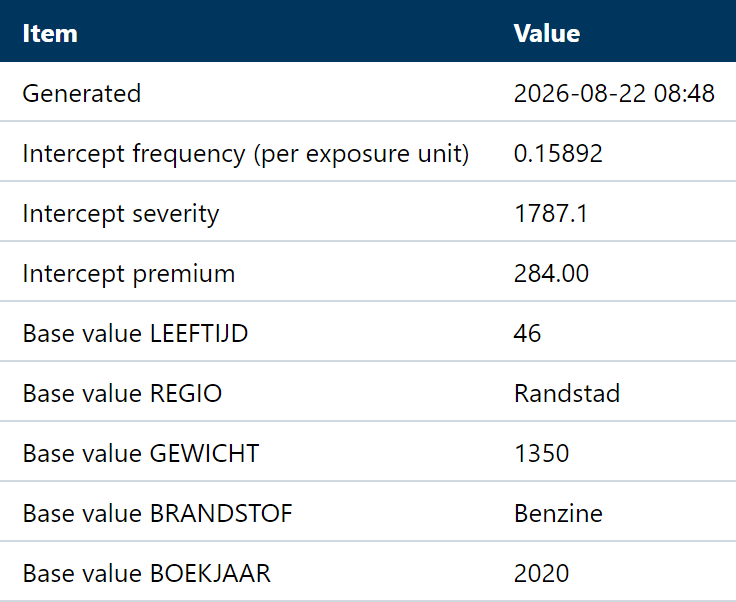

The variable sheets carry the same highlighting shown under
[`make_rating_table()`](#make_rating_table): base row picked out, thin rows
greyed.

### `pricing_report()`

One call that bundles the whole analysis into a single HTML report.

```r
pricing_report(model_freq = NULL, model_sev = NULL, data,
               file = "pricing_report.html",
               title = "GLM Pricing Report",
               variables = NULL,
               include = c("diagnostics", "oneway", "ae", "pdp", "rating",
                           "interactions"),
               by_year = FALSE, top_interactions = 3, grid_res = 50,
               base_level = c("first", "exposure"), trim = c(0, 1), ...)
```

The report contains the diagnostics table with binned residual plots, and,
per variable (default: all base variables of both models), the one-way
observed plot, actual vs expected (frequency and severity), partial
dependence and the rating-factor plot, plus a section with all interaction
plots. The `"interactions"` block additionally runs
[`detect_interactions()`](#detect_interactions) and plots the strongest
`top_interactions` pairs as A/E heatmaps. Individual plot failures are shown
as a note instead of aborting the report.

It is built with `htmltools` (no pandoc needed); all plots remain fully
interactive. Next to the `.html` a `<name>_files/` folder is written with
the JavaScript dependencies, keep the two together when sharing.

The top of a generated report: title, both model formulas, a table of
contents, and the diagnostics block:

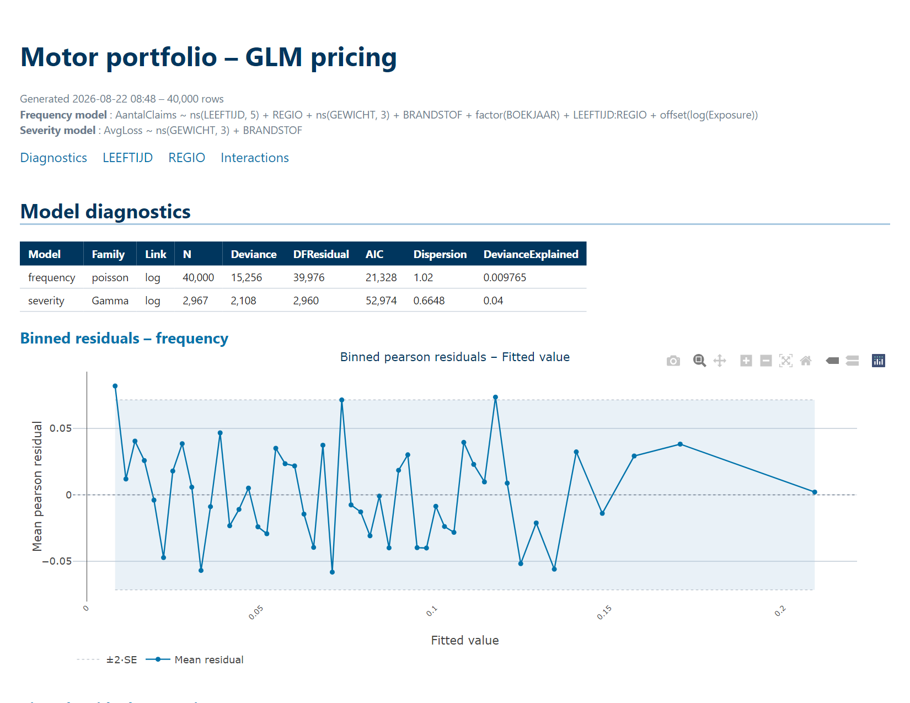

---

## Actuarial methodology

The [function reference](#function-reference) above covers *how to use* each
function and how to read its output. This section covers *why* things are
computed the way they are, the reasoning you would want before putting a
number in front of a pricing committee.

### Methods at a glance

One line per function: what it computes, the expression behind it, and the
assumption it relies on. `y` is the response, `μ` the fitted value, `w` the
exposure or prior weight, `a` and `e` actual and expected claims in a cell.

| Function | Computes | Key expression | Relies on |
|---|---|---|---|
| [`agg_all()`](#agg_all) | frequency and severity per level | `Σclaims / Σexposure` and `Σloss / Σclaims` | none |
| [`make_plot()`](#make_plot) | the observed one-way | as above, per level of one variable | none |
| [`plot_glm_predictor()`](#plot_glm_predictor) | actual vs expected per bin | counts: `Σy/Σw` against `Σμ/Σw`; weighted models: prior-weight-weighted means | log link, to recover exposure as `exp(offset)` |
| [`make_pdp()`](#make_pdp) | the partial effect on the response scale | weighted mean of `predict(type = "response")` per grid point, offset subtracted on the link scale → [why](#why-the-pdp-is-computed-on-the-response-scale) | offset read from the model → [how](#deriving-the-offset-and-the-link) |
| [`glm_diagnostics()`](#glm_diagnostics) | fit and dispersion | Pearson `χ²/df`; `1 − D/D₀` | → [overdispersion](#overdispersion) |
| [`glm_collinearity()`](#glm_collinearity) | how far each term is explained by the others | generalised VIF, `GVIF^(1/(2·DF))` | terms, not coefficients |
| [`model_lift()`](#model_lift) | risk separation across the book | `Σactual/Σw` against `Σpred/Σw` per equal-exposure bin; Gini on the Lorenz curve | → [what lift measures](#what-lift-and-gini-do-and-do-not-measure) |
| [`double_lift()`](#double_lift) | which of two tariffs is right where they differ | A/E of each model per bin of the rate ratio `new/old` | rebased to equal totals |
| [`plot_glm_residuals()`](#plot_glm_residuals) | binned residuals | mean residual per bin, band `±2·√(φ/n)` | the dispersion estimate `φ` |
| [`plot_glm_qq()`](#plot_glm_qq) | does the response match the family | randomised quantile residual `Φ⁻¹(U(F(y⁻), F(y)))` → [why not the classical residuals](#reading-a-q-q-plot-of-quantile-residuals) | a closed-form CDF for the family |
| [`plot_glm_influence()`](#plot_glm_influence) | which rows move the fit | leverage vs standardised residual, sized by Cook's `D` | → [on a large book](#cooks-distance-on-a-large-book) |
| [`detect_interactions()`](#detect_interactions) | interaction structure the GLM missed | `D = 2·Σ[a·log(a/e*) − (a − e*)]`, where `e*` is `e` raked to `a`'s margins; null by simulation → [why](#why-a-one-way-check-cannot-see-an-interaction) | Poisson counts (otherwise `χ²` scaled by `φ`) |
| [`plot_residual_heatmap()`](#plot_residual_heatmap) | A/E per cell | `Σa / Σe` per cell of two variables | none |
| [`screen_features()`](#screen_features) | incremental value of a candidate | increase in out-of-sample deviance when the feature is shuffled, baseline margin held fixed | a holdout split; log link |
| [`make_rating_table()`](#make_rating_table) | multiplicative relativities | `pred(level, rest at base) / pred(base)`; interaction uplift `joint / (mainₓ · main_g)` → [why](#multiplicative-rating-and-the-reconstruction-identity) | log link |
| [`make_rating_plot()`](#make_rating_plot) | those relativities, plotted | none | → [thin cells](#thin-cells) |
| [`premium_impact()`](#premium_impact) | dislocation against the current tariff | `new/old − 1` per policy, optionally rebased so the totals match | log link, to price at exposure = 1 |
| [`export_rating_table()`](#export_rating_table) / [`pricing_report()`](#pricing_report) | deliverables | none | none |

Two assumptions run through almost the whole table and are worth stating
once. **The log link** is what makes relativities multiplicative and lets
`exp(offset)` be read back as exposure; a different link makes several of
these numbers something other than what their names suggest, which is why
the functions warn about it. **Exposure weighting** is done by summing
numerator and denominator separately (`Σa / Σe`), never by averaging ratios,
an average of ratios would give a policy with a month of exposure the same
say as one with a full year.

### Multiplicative rating and the reconstruction identity

For log-link GLMs the prediction factorises multiplicatively. The rating
table exploits this with a single consistent **base point**:

- categorical variables → reference level (`base_level`),
- continuous variables → the **median** (inserted as an explicit grid point),
- the exposure column → **1**.

Every factor is `prediction(level, others at base) / prediction(base)`, and
the intercept attributes are the prediction at the base point itself. For a
log-link model **without interactions** this makes the identity exact:

```
prediction(x₁, …, xₖ, exposure = 1)
  = intercept × Factor(x₁) × … × Factor(xₖ)
```

(verified to 1e-10 in the test suite). With interactions, the joint
relativity of a pair decomposes as `main_x × main_group × Uplift`, so the
uplift columns isolate what the interaction adds on top of the main effects.

Because the intercept is evaluated at exposure = 1, it is a true base
frequency (respectively base severity / base risk premium) per unit of
exposure, not a value at some arbitrary portfolio exposure.

### Why the PDP is computed on the response scale

A naive GLM PDP averages link-scale predictions and back-transforms:
`exp(mean(link))`. That is a *geometric* mean, and with an exposure offset
it also absorbs the average log-exposure. Both effects bias the curve low
relative to observed frequencies (Jensen's inequality), making the
model-vs-data comparison misleading.

`make_pdp()` therefore:

1. neutralises the offset (exposure = 1),
2. predicts on the response scale, and
3. takes the exposure-weighted (frequency) or claim-weighted (severity)
   arithmetic mean,

which is the same estimand as the observed `sum(claims) / sum(exposure)`
line it is plotted against.

### Actual vs expected

`plot_glm_predictor()` compares like with like: for offset models it
aggregates counts and exposure before dividing (`Σ observed / Σ exposure` vs
`Σ predicted / Σ exposure`); for weighted models it uses
prior-weight-weighted means. Quantile binning keeps each bin credible
instead of leaving near-empty tail bins that look like misfit but are noise.

### Why a one-way check cannot see an interaction

This is not a matter of bad luck or too little data; it is structural. The
score equations of a GLM weight each observation by `(dμ/dη) / V(μ)`, and
for a **canonical** link that weight is exactly 1. What is left is `Σ x(y −
μ) = 0` for every column of the design matrix, so for a categorical variable
in the model the fitted total equals the observed total at every level, the
A/E is exactly 1.000, no matter what happens inside the cells:

```
A/E per REGIO:   Dorp 1.0000   Platteland 1.0000   Rand 1.0000   Stad 1.0000
```

A missing interaction cancels out in the margins by construction. No amount
of one-way plotting will reveal it, and an actual-vs-expected plot per
predictor will look perfect while whole cells of the portfolio are mispriced
by tens of percent. That is precisely the blind spot
[`detect_interactions()`](#detect_interactions) and
[`plot_residual_heatmap()`](#plot_residual_heatmap) exist to cover.

#### Frequency is exactly blind, severity almost

Poisson with a log link is canonical, so a frequency model is blind by
identity. **Gamma with a log link is not**, the canonical link for Gamma is
the inverse, so this argument does not carry over to a severity model
unchanged. It does not disappear either; it changes what gets pinned.

With a log link on a Gamma, the score weight is `μ/μ² = 1/μ`, so the
equations reduce to `Σ x·w·(y/μ − 1) = 0`. What is forced to exactly 1 is
the weighted mean of the **ratio**, not the ratio of the weighted totals.
Measured on 40,000 rows:

| Model | `Σwy / Σwμ` (the A/E) | `Σw(y/μ) / Σw` |
|---|---|---|
| Poisson log (canonical) | **1.0e-14** | 1.3e-02 |
| Gamma log (used here) | 1.2e-04 | **3.3e-09** |
| Gamma inverse (canonical) | **2.6e-10** | 1.2e-04 |

Each link pins something exactly; the canonical one happens to pin the
quantity an A/E plot draws.

So a severity model does leave a residue in the one-way A/E, and it is far
too small to work with. On the same data:

- with no interaction at all: max `|A/E − 1|` = **0.012%**
- with a genuine omitted interaction of 35%: **0.259%**

A real effect is only about twenty times the numerical floor, and a quarter
of a percent is invisible on an axis running in the thousands. So the
practical conclusion is unchanged for both sides of the tariff: the one-way
check does not find interactions. It is exact blindness for frequency and
effective blindness for severity, and the cell-level tools are what cover it
either way.

There is a second route to the same blindness that has nothing to do with
the link: a model **saturated** in a variable fits each of its levels
exactly, so the A/E is 1.000 there whatever the link. Verified with an
identity-link Poisson on a single factor: max `|A/E − 1|` = 9.9e-14.

Two things to keep in mind when acting on what they find:

- **A candidate is a hypothesis, not a conclusion.** It only counts if
  adding the term to the GLM improves out-of-sample fit, the resulting
  factor pattern is explainable, and it holds up in another accounting
  year. The scan proposes; the GLM decides.
- **Beware of proxies and mix.** A detected `A × B` can be standing in for
  an unmodelled `C`, and an "interaction" with the accounting year is
  usually portfolio mix or trend rather than risk structure.

`demo/detect_interactions.R` walks through the whole cycle on a simulated
portfolio where the true interaction is known.

### Thin cells

Levels backed by very few claims get `IsThin = TRUE` (claim count below
`min_claims`, default 30). This matters because a GLM applies **no
shrinkage** to a categorical level: its coefficient comes essentially from
that level's own claims, so a factor built on a handful of them is an
unstable estimate rather than a signal. (Continuous variables fitted with
splines do borrow strength from neighbouring grid points, so a sparse
stretch of the curve is still supported by the data around it.)

The flag is surfaced everywhere the factors are shown, `make_rating_plot()`
dims the markers and adds a "low claim volume" note to the tooltip,
`export_rating_table()` greys out the row, and `make_rating_table()` warns
when a categorical level trips the threshold, so a factor of 1.4 on 12
claims is never read with the same confidence as one on 12,000. What to do
about it (grouping the level with a related one, capping the factor, or
leaving it out of the tariff) stays a judgement call; the package only flags
it.

### What lift and Gini do and do not measure

A Gini measures **ordering**, nothing else. It asks whether the policies the
model calls expensive really are, relative to the ones it calls cheap. It
says nothing about whether the level is right: multiply every prediction by
three and the Gini is unchanged while the tariff is ruinous. The lift chart
is what catches that, because it puts actual and predicted on the same axis,
per bin.

So read them together: **Gini for discrimination, the lift chart for
calibration.** A model can be excellent at one and poor at the other.

A single lift chart also cannot rank two candidates. Both can look
convincing separately while disagreeing sharply about individual policies,
and the disagreement is the whole question. That is what
[`double_lift()`](#double_lift) isolates: it bins on the ratio of the two
predictions, so the end bins contain exactly the policies where the models
part company, and the A/E lines show who is right there.

Two cautions. Lift on the training data flatters both models, which is why
`data` is exposed for a holdout. It will not stop you, but it will label the
plot in-sample. And `double_lift()` rebases the two sides to the same total
by default: without that, a candidate that is simply 10% cheaper everywhere
would look systematically better, when the comparison is about
differentiation rather than rate level.

### Collinearity

Collinearity does not damage predictions; it damages **interpretation**. A
GLM with two near-duplicate predictors can fit and forecast perfectly well
while splitting the effect between them arbitrarily, so the individual
coefficients, and therefore the rating factors, swing wildly with small
changes in the data.

That matters here specifically because a rating table *is* an
interpretation: [`make_rating_table()`](#make_rating_table) reads each
term's coefficients back out as relativities. If two terms are collinear,
those two columns of the table are not trustworthy even though the model is
fine. [`glm_collinearity()`](#glm_collinearity) is the check, on the
generalised VIF scale because pricing terms span multiple columns.

### Overdispersion

Poisson frequency models on real portfolios are almost always overdispersed
(unobserved heterogeneity). `glm_diagnostics()` estimates the Pearson
dispersion and warns above 1.2: coefficient estimates remain consistent, but
standard errors scale with √dispersion, so term selection based on naive
Poisson p-values is anti-conservative. Refit with `quasipoisson()` or a
negative binomial family when flagged.

### Deriving the offset and the link

Everything needed is on the fitted model, so nothing is assumed. The link
and its inverse come from `family(model)`, and the offset from the model's
own terms, so the neutralised prediction is simply

$$\hat\mu_{\text{rate}} = g^{-1}\big(\hat\eta - \text{offset}\big)$$

which is exact for **any** link and **any** offset expression. No family
is a special case and none is unsupported.

That is worth spelling out because the obvious shortcut, set the exposure
column to 1 so `log(1) = 0`, silently is not. It neutralises exactly one
offset and mis-scales the rest. Measured on the same model and data, rate
per unit of exposure:

| Model | column set to 1 | offset subtracted | correct |
|---|---|---|---|
| `offset(log(Exposure))` | 0.13063 | 0.13063 | 0.13063 |
| `offset(Exposure)` | 0.11764 | 0.04328 | 0.04328 |
| `offset(log(Maanden/12))` | 0.01089 | 0.13063 | 0.13063 |

A factor `e` out on the second, because setting the column to 1 leaves the
offset at 1 rather than 0, and a factor 12 out on the third, because it
leaves `log(1/12)`. Where the shortcut was already right the two agree to
6·10⁻¹⁷.

#### Where the offset can hide

An offset reaches a `glm` by two different routes, and only one of them
lands in `terms()`:

```r
glm(y ~ x + offset(log(E)), ...)   # in the formula  -> attr(terms, "offset")
glm(y ~ x, offset = log(E), ...)   # as an argument  -> model$call$offset
```

Both are read, and a model carrying both has them added, which is exactly
what `predict.lm` does internally. How the formula was *written* makes no
difference: `as.formula("y ~ x + offset(log(E))")`, a `paste()`
construction and `update()` all give the same terms object.

The argument form carries one constraint, and it is base R's rather than
ours: `predict.lm` evaluates `model$call$offset` against `newdata` alone,
with no fallback to the environment the model was fitted in. So the
variables the offset names must be **columns of the data being scored**.
`offset = log(Exposure)` is fine, because `Exposure` travels with the
data; `offset = some_vector_from_the_workspace` is not, and scoring it
raises an error rather than recycling into a confidently wrong number.
Putting the offset in the formula avoids the question entirely.

#### What the link does and does not decide

The link does not decide whether the offset can be removed, only what the
result **means**:

- **A log link makes the model multiplicative**, so removing the offset
  gives a rate that a second model may be multiplied onto. That is what
  the frequency × severity workflow rests on.
- **Any other link is additive on its own scale.** The offset still comes
  out, and the prediction at zero offset is exactly right, but it is not a
  multiplicative rate and multiplying a severity model onto it means
  nothing. The functions say so rather than let it pass.

One genuinely separate question is whether `exp(offset)` is an exposure,
which is used for weighting rather than for prediction. It is one only
when the offset is a **logarithm**: with `offset(Exposure)` it is
`exp(Exposure)`, not a volume. That is also read off the model, and the
A/E and weighting code falls back to the prior weights and says why.

**Rating-table factors were never affected** by any of this. They are
ratios of two predictions that share the same base row, so whatever the
offset contributes cancels. The intercept is the one number that carried
it.

Removing the offset on the link scale leaves rounding noise of order 10⁻¹⁶
where the shortcut produced bit-identical values, so the tie check in the
lift charts counts distinct predictions at a tolerance rather than bit for
bit.

### Reading a Q-Q plot of quantile residuals

A normal Q-Q plot of the classical residuals is close to useless for a
frequency model, because for counts none of them are normal. What the
standard tools actually draw:

| Package | Q-Q of a glm uses |
|---|---|
| base R `plot(model)` | `rstandard(type = "pearson")`, labelled "Std. Pearson resid." |
| `boot::glm.diag.plots()` | standardised deviance, `dev / (sd·√(1−h))` |
| `car::qqPlot()` | declines, *"QQ plot for studentized residuals not available for glm"* |
| `statmod::qresid()` | randomised quantile residuals (what this package uses) |
| `DHARMa` | simulated residuals, Q-Q against a **uniform** |

On a correctly specified Poisson with 20,000 rows, 87% of them claim-free:

| residual | outside a nominal 5% band | KS test vs N(0,1) |
|---|---|---|
| base R, std. Pearson | 8.34% | `p < 2e-16` |
| `boot`, std. deviance | 1.31% | `p < 2e-16` |
| quantile residual | 5.10% | `p = 0.86` |

The two classical ones fail in opposite directions, Pearson too heavy in the
tails, deviance too light, and both reject a model that is exactly right, so
neither can tell you anything about one that is not. Where the fitted mean
varies little they also collapse onto visible bands, because the response
takes only a handful of values.

`plot_glm_qq()` uses the **randomised quantile residual** instead (Dunn &
Smyth, 1996). For a continuous response,

$$r_i = \Phi^{-1}\!\big(F(y_i;\hat\mu_i,\hat\phi)\big)$$

and for a discrete one the CDF jumps, so the value is drawn uniformly inside
the jump:

$$u_i \sim \mathrm{U}\big(F(y_i-1;\hat\mu_i),\,F(y_i;\hat\mu_i)\big),
\qquad r_i = \Phi^{-1}(u_i)$$

Under a correctly specified model these are **exactly** standard normal,
discreteness included, which is what the table above shows. Per family:

| Family | CDF used | Dispersion |
|---|---|---|
| Poisson | `ppois(y, μ)` with the jump randomised | fixed at 1, that assumption is what the plot tests |
| Gamma | `pgamma(y, shape = w/φ, scale = φμ/w)` | Pearson estimate |
| binomial | `pbinom` on `y·w`, jump randomised | fixed at 1 |
| gaussian | `pnorm(y, μ, √(φ/w))` | Pearson estimate |

The Gamma parameterisation is the GLM's own assumption written out: mean `μ`
and variance `φμ²/w`, which is exactly what `weights = AantalClaims` encodes
on an average-claim-size response.

Because the count case is randomised, two calls give slightly different
pictures; pass `seed` for a reproducible one. The implementation is verified
against `statmod::qresid()`, identical for Poisson, equal to 6e-14 for
Gamma.

The other principled route is a **simulated envelope**, as `DHARMa` and
`hnp` use: simulate from the fitted model and locate each observation in
that distribution. It generalises further (mixed models, zero-inflation) but
costs `n_sim` simulations per row, so the closed-form residual is the better
fit for a large book. Its one advantage here is that the envelope accounts
for the coefficients having been estimated, while the analytic band from the
Beta order statistics treats them as known and is therefore marginally too
narrow. The band is also pointwise, not simultaneous: with several thousand
points a handful fall outside it even when the model is right. Read the
shape, not the exceptions.

### Cook's distance on a large book

Cook's distance was designed for regressions with tens of observations,
where one point can genuinely swing a coefficient:

$$D_i = \frac{r_{P,i}^2\,h_i}{\phi\,p\,(1-h_i)^2}$$

On a book of 100,000 policies no single row does. Every absolute rule of
thumb breaks with it: `D > 1` never triggers, and `D > 4/n`, here `4 ×
10⁻⁵`, flags thousands of perfectly ordinary rows. So `plot_glm_influence()`
is deliberately **relative**: it ranks rows against each other and labels
the worst `n_label`, rather than testing them against a threshold that does
not apply. The only absolute reference kept is the leverage line at `2p/n`,
which still means what it always did.

What the ranking is good for is **data quality**: a vehicle weight of 20
tonnes or an age of 200 lands at the top and is worth opening. It is a much
weaker tool for model structure, where
[`detect_interactions()`](#detect_interactions) and
[`plot_glm_residuals()`](#plot_glm_residuals) have far more power, because
structural misfit is spread over many rows and none of them stands out
individually.

**Influence is not misfit, and on a Poisson the two can be opposites.**
The IRLS weight of a row is its fitted mean, so a policy with a sliver of
exposure carries almost no weight in the design matrix and has almost no
leverage, whatever its response. Measured over three seeds on 15,000-row
books, implanting each classic keying error one at a time:

| Implanted error | rank on Cook's `D` | rank on Pearson size | leverage |
|---|---|---|---|
| exposure 0.001 with claims | 26 / 35 / 43 | **1 / 1 / 1** | 5·10⁻⁷ |
| vehicle weight 20 tonnes | **1 / 1 / 1** | 1691 / 15000 / 2304 | 0.91 |

They are exact complements. The low-exposure row is the worst-fitted row in
the book and Cook's distance cannot see it at all. The extreme-predictor row
tops the Cook ranking and has an *unremarkable* residual, at a leverage of
0.9 the fit bends to meet it, so the point masks itself.

That is why this is a two-axis plot and not an index plot of `D`: it
separates *unusual in the predictors* (far right) from *badly fitted* (far
up or down), and neither axis alone finds both errors. A residual check,
[`plot_glm_qq()`](#plot_glm_qq) or
[`plot_glm_residuals()`](#plot_glm_residuals), is the complement that
catches the low-exposure case.

---

## Input validation and warnings

The functions fail fast with explicit messages rather than producing
silently wrong numbers:

- **Errors**: missing columns (named per function), non-glm model objects,
  models fitted without `data =` where training data is needed, unknown
  `weight_var`, unmatched predictors, invalid `trim`.
- **Warnings**:
  - `NA`s in exposure/claims/loss inputs and groups with exposure ≤ 0
    (`agg_all`);
  - non-log link where multiplicativity or `exp(offset)` is assumed
    (`make_rating_table`, `make_pdp`, `plot_glm_predictor`);
  - an offset that cannot be neutralised because the exposure column is not
    in the training data (`make_pdp`);
  - unweighted PDP averaging when no offset/weights are found;
  - skipped rating-table terms/interactions, with the reason;
  - overdispersion in Poisson/binomial models (`glm_diagnostics`);
  - categorical rating-table levels with fewer than `min_claims` claims
    (`make_rating_table`).

## Tests

The package ships with a `testthat` suite (`tests/testthat/`) that simulates
a portfolio, fits Poisson/Gamma models and verifies among other things:
exact premium reconstruction from the table, factor = 1 on base rows, uplift
= 1 at reference levels, PDP = exposure-weighted mean response at exposure
1, offset-neutralised intercepts, inline `factor()` handling, custom column
names, the non-log-link warning, the overdispersion warning, binned
residuals staying within the ±2·SE band for a correct model, the thin-cell
flag, zero dislocation for identical models and exact rebase behaviour in
`premium_impact()`, the Excel workbook structure, and the generated HTML
report. For the interaction tools it simulates a portfolio with a *known*
missing interaction and checks that `detect_interactions()` ranks the true
pair first, and that a portfolio without any interaction produces no signal.
Run it with:

```r
devtools::test()        # or:
devtools::check()       # full R CMD check, as run in CI on every push
```

The GitHub Actions workflow (`R-CMD-check`) runs the full check on every
push to `main`.

## Demo and figures

`demo/run_demo.R` simulates a 100k-policy motor portfolio (with a
deliberately rare fuel type to show the thin-cell flags, and a real age x
region interaction) and writes every deliverable: the HTML report, the Excel
rating workbook and the impact analysis.

Its last block is a worked **bonus-malus** example, which is the case for a
second offset. A BM ladder is a commercial decision, not something you
estimate, so it goes in as `offset(log(BM))` next to the exposure and the
GLM prices everything else around it. The block quotes one policy line by
line:

```
Base premium (per policy-year, before BM) 310.9550  310.95
x LEEFTIJD = 24                             1.1956  371.78
x REGIO = Noord                             0.7559  281.03
x GEWICHT = 2000                            1.5960  448.53
x BRANDSTOF = Elektrisch                    1.3119  588.44
x BM class M (malus)                        1.4000  823.82
x Exposure = 0.5 year                       0.5000  411.91

Chain: 411.91   predict(): 411.91   difference: 4.55e-13
```

Note where BM sits: the rating table gives the tariff **before** the
discount, because `.model_rate()` removes both offsets, and the ladder is
applied afterwards — which is how you would publish it anyway.

It then shows the diagnostic that a second offset makes possible. BM
carries no estimated parameter, so its A/E is **not** pinned to 1 the way a
fitted categorical term is, and comparing A/E per class is a real test of
whether the ladder matches the experience. On a correct ladder every class
sits near 1; priced on a ladder half as steep, the same portfolio gives:

```
 BM_KLASSE     AE Gebruikt Zou_moeten  Ratio
         M 1.2066    1.200       1.40 1.1667
         0 1.0164    1.000       1.00 1.0000
         5 0.9344    0.925       0.85 0.9189
        10 0.8477    0.850       0.70 0.8235
        15 0.7159    0.775       0.55 0.7097
```

The A/E per class tracks the ratio of the factor that *should* have been
used to the one that was. A ladder that fits shows no gradient at all.

`demo/detect_interactions.R` simulates a portfolio where young drivers are
extra risky in the city, fits a GLM *without* that interaction, and walks
through the full cycle: the one-way checks coming back clean, the scan
ranking the true pair far above the rest, the heatmap showing which cells
are mispriced, and the out-of-sample deviance confirming the fix.

`demo/make_readme_figures.R` regenerates the PNGs in `man/figures/` used
above, by rendering the plotly widgets in headless Chrome (requires
`webshot2` and a Chrome installation). Run them from the project root:

```sh
Rscript demo/run_demo.R
Rscript demo/detect_interactions.R
Rscript demo/make_readme_figures.R
```

## Known limitations

Deliberately out of scope (for now):

- **No uncertainty quantification**, the rating factors carry no standard
  errors or confidence intervals.
- **In-sample by default**, every diagnostic evaluates on the model's own
  rows unless told otherwise. Two functions do more:
  [`model_lift()`](#model_lift) and [`double_lift()`](#double_lift) take a
  holdout through `data`, and [`screen_features()`](#screen_features)
  splits internally because a booster is meaningless without one. There is
  no cross-validation and no automated backtesting.
- **Frequency × severity only**, direct risk-premium (e.g. Tweedie) models
  do not fit the rating-table structure.
- **No rate-making beyond the risk premium**, no on-levelling, trend
  adjustment or loading for expenses, commission and profit.
- **Two-way interactions only**, higher-order interaction terms are skipped
  (with a warning).
- `make_pdp()` and `plot_glm_predictor()` support `glm` objects only.

---

## Appendix: full function specification

A complete technical specification of every exported function: signature,
every argument, the algorithm step by step, the exact return structure, the
assumptions it rests on, its error and warning behaviour, and its cost. The
[function reference](#function-reference) above is the practical guide; this
appendix is the reference you check when you need to know precisely what a
number is.

Conventions used throughout: `y` is the response, `μ` the fitted value, `w`
the exposure or prior weight, `a` and `e` the actual and expected claims in
a cell, `n` the number of rows, `p` the number of features. "Model rows"
means the rows the model was actually fitted on, the rows of
`model.frame(model)`, which excludes anything dropped by `na.action`.

### Shared behaviour

These rules hold for every function that takes a fitted `glm`.

**Row alignment.** Values are read from the model's own rows. Internally
`model.frame(model)` is matched to `model$data` by row *name*, never by
position, so a model fitted on a filtered subset (`dat[dat$x > 0, ]`) or one
that dropped `NA` rows still lines up with its fitted values. A model fitted
without a `data =` argument cannot be aligned; functions that need the
original columns stop with that message.

**Frequency versus severity mode.** Detected from the model, never
declared by the user:

| Condition | Mode | Actual | Expected | Weight |
|---|---|---|---|---|
| offset present *and* link is `log` | counts | `y` (claim counts) | `μ` (fitted counts, exposure included) | `exp(offset)` |
| otherwise | weighted | `w · y` (e.g. total loss) | `w · μ` | `model$prior.weights` |

Taking totals in both modes means `Σactual / Σexpected` is the correctly
weighted ratio without a separate division step.

**Grouping rule.** Wherever a variable has to be grouped, the same rule
applies: a factor or character keeps its levels; a numeric with at most
`n_bins` distinct values is grouped on its **exact values**; only above that
are quantile bins used. This is why a vehicle age of 0 stays at 0 instead of
being merged with 1 into a point at 0.78, and why one outlier cannot shift
every other point.

**Exposure weighting.** Always `Σnumerator / Σdenominator`, never the mean
of per-row ratios: averaging ratios would give a policy with one month of
exposure the same weight as one with a full year.

---

### `agg_all()` specification

**Purpose.** Aggregate raw policy rows to one row per level of a grouping
column, with frequency and severity computed on the aggregate.

```r
agg_all(d, col, by_year,
        exposure_col = "Exposure", claims_col = "AantalClaims",
        loss_col = "SCHADELAST", year_col = "BOEKJAAR")
```

| Argument | Type | Default | Meaning |
|---|---|---|---|
| `d` | data.frame / data.table | required | raw rows |
| `col` | character(1) | required | grouping column |
| `by_year` | logical(1) | required | also split by accounting year |
| `exposure_col` | character(1) | `"Exposure"` | exposure column |
| `claims_col` | character(1) | `"AantalClaims"` | claim count column |
| `loss_col` | character(1) | `"SCHADELAST"` | loss amount column |
| `year_col` | character(1) | `"BOEKJAAR"` | accounting-year column |

**Algorithm.** Coerce to `data.table`; sum exposure, claims and loss by
`col` (and `year_col`); derive `Frequency = ClaimCount / Exposure` where
exposure is positive and `NA` elsewhere; derive `Severity = Loss /
ClaimCount` where claims are positive and `NA` elsewhere; return as a
`data.frame`.

**Returns.** A data.frame with standardised English names regardless of
the input naming: `col`, `[Year,]` `Exposure`, `ClaimCount`, `Loss`,
`Frequency`, `Severity`. `Year` is a factor.

**Warnings.** One per input column containing `NA` (stating how many), and
one if any group has non-positive exposure (stating how many).

**Errors.** Any named column absent from `d`, listing all missing names.

**Cost.** One `data.table` group-by, O(n).

---

### `make_plot()` specification

**Purpose.** One-way plot of observed frequency or severity with exposure
bars on a secondary axis.

```r
make_plot(data, col, metric = c("Frequency", "Severity"),
          color_single, y_label, display = c("color", "facet"), by_year,
          metric_fmt = 4, exposure_col = "Exposure",
          claims_col = "AantalClaims", loss_col = "SCHADELAST",
          year_col = "BOEKJAAR", discrete_cutoff = 25, y_range = NULL)
```

| Argument | Type | Default | Meaning |
|---|---|---|---|
| `data` | data.frame | required | **raw** rows; aggregation happens inside |
| `col` | character(1) | required | X-axis column |
| `metric` | character(1) | `"Frequency"` | quantity to plot |
| `color_single` | colour | required | line colour when `by_year = FALSE` |
| `y_label` | character(1) | required | Y-axis label |
| `display` | character(1) | `"color"` | `"color"` = one line per year; `"facet"` = one panel per year |
| `by_year` | logical(1) | required | split by accounting year |
| `metric_fmt` | integer | `4` | tooltip decimals |
| `discrete_cutoff` | integer | `25` | numeric X with at most this many distinct values is drawn as markers only |
| `y_range` | numeric(2) or NULL | `NULL` | fix the metric axis; `NULL` auto-scales |

**Algorithm.** Call `agg_all()` on the raw rows; rename the X column to an
internal name; decide discrete versus continuous; sort by X (and year); for
the bars, sum exposure over years when `by_year = TRUE`. In `"facet"` mode
the exposure bars are rescaled per panel to the metric range so both fit one
axis (the tooltip shows the true value); in `"color"` mode plotly draws the
bars on a genuine secondary axis.

**Returns.** A plotly object.

**Notes.** In `"color"` mode with `by_year = TRUE` the bars show the sum
over all years, and are labelled "Exposure (all years)" to say so. A fixed
`y_range` in `"facet"` mode switches the facets from free to fixed scales,
so every panel shares it.

**Errors.** Missing columns; `metric` or `display` outside their allowed
values; `y_range` not `c(lo, hi)` with `lo < hi`.

**Cost.** One aggregation plus rendering, O(n).

---

### `make_pdp()` specification

**Purpose.** Partial dependence of a fitted `glm` on the response scale,
overlaid with the observed one-way statistic.

```r
make_pdp(model, raw_data, pred_var, metric = c("Frequency", "Severity"),
         transform = NULL, grid_res = 50, y_label = NULL, metric_fmt = 4,
         exposure_col = "Exposure", claims_col = "AantalClaims",
         loss_col = "SCHADELAST", discrete_cutoff = 25, y_range = NULL)
```

| Argument | Type | Default | Meaning |
|---|---|---|---|
| `model` | glm | required | fitted with `data =` |
| `raw_data` | data.frame | required | data for the observed line and the bars |
| `pred_var` | character(1) | required | predictor to profile |
| `metric` | character(1) | `"Frequency"` | which observed statistic to overlay |
| `transform` | function or NULL | `NULL` | **deprecated**, ignored with a warning |
| `grid_res` | integer | `50` | grid points for a continuous predictor |
| `y_label`, `metric_fmt` | | `NULL`, `4` | axis label (auto) and tooltip decimals |
| `y_range` | numeric(2) or NULL | `NULL` | fix the primary axis |

**Algorithm.**

1. Aggregate `raw_data` to the observed line: frequency
   `Σclaims / Σexposure` per level, or severity `Σloss / Σclaims` over
   rows with claims.
2. Recover the training data and the averaging weights: `exp(offset)` for
   frequency, prior weights for severity.
3. **Neutralise the offset** by setting the exposure column to 1, so
   predictions are per unit of exposure.
4. Build the grid: factor levels, or the sorted distinct values when there
   are at most `grid_res` of them, otherwise an equally spaced sequence.
5. **Collapse to unique profiles.** Rows sharing identical values on all
   other predictors give identical predictions at every grid point, so
   they are collapsed with summed weights.
6. For each grid value, set `pred_var` to it across the profiles, predict
   with `type = "response"`, and take the **weighted arithmetic mean**.

**Returns.** A plotly object with three traces: exposure (or claim-count)
bars, "Observed", and "PDP (model)".

**Assumptions.** The offset is neutralised for any offset expression and
any link, by subtracting the model's own offset on the link scale, see
[deriving the offset and the link](#deriving-the-offset-and-the-link). The
**weighting** is the part that still needs `log` on both counts:
`exp(offset)` is an exposure only when the link is `log` and the offset is a
logarithm, and a warning is raised for each of those separately.

**Interpretation.** The observed line is a one-way marginal and includes
correlations with every other rating factor; the PDP is a partial effect. A
gap between the two is not by itself evidence of misfit.

**Errors.** Not a `glm`; training data not recoverable; `pred_var` absent;
a column needed for prediction missing from the training data.

**Cost.** `grid_res × (number of unique profiles)` predictions rather than
`grid_res × n`. On a 1M-row portfolio with ~54k profiles this was measured
at 9 s against ~75 s for the naive loop, with identical results to machine
precision. If it is slow, the profile count is the driver: band very
granular covariates or lower `grid_res`.

---

### `plot_glm_predictor()` specification

**Purpose.** Actual versus expected per (binned) level of one predictor,
on the model's own rows.

```r
plot_glm_predictor(model, predictor, n_bins = 150, weight_var = NULL,
                   weight_label = NULL, color = ta_year_palette(1),
                   color_pred = ta_gold, title = NULL, ylab = NULL,
                   xlab = NULL, metric_fmt = 4,
                   bin_type = c("quantile", "width"), y_range = NULL)
```

| Argument | Type | Default | Meaning |
|---|---|---|---|
| `n_bins` | integer | `150` | **maximum number of points**, not a fixed bin count |
| `weight_var` | character(1) or NULL | `NULL` | override the weight column (must exist in `model$data`) |
| `bin_type` | character(1) | `"quantile"` | `"quantile"` = equal counts per bin; `"width"` = equal width |
| `y_range` | numeric(2) or NULL | `NULL` | fix the primary axis, e.g. to compare predictors |

**Algorithm.** Detect the mode (see [shared behaviour](#shared-behaviour));
build a frame of predictor, observed, predicted and weight; group by the
[grouping rule](#shared-behaviour); per group compute `Σobserved / Σweight`
against `Σpredicted / Σweight` in counts mode, or prior-weight-weighted
means otherwise. A binned point is positioned at the weighted mean of its
bin; an unbinned point at its exact value.

**Returns.** A plotly object with weight bars, "Observed" and "Predicted".

**Warnings.** An offset with a non-log link (falls back to prior weights).

**Errors.** Not a `glm`; `n_bins < 2`; predictor not found; unknown
`weight_var`; invalid `y_range`.

**Cost.** One `predict()` over the model rows plus a group-by, O(n).

---

### `glm_diagnostics()` specification

**Purpose.** Compact fit summary for a frequency and/or severity model.

```r
glm_diagnostics(model_freq = NULL, model_sev = NULL)
```

**Returns.** One row per supplied model:

| Column | Meaning |
|---|---|
| `Model` | `"frequency"` / `"severity"` |
| `Family`, `Link` | from `family(model)` |
| `N`, `Deviance`, `DFResidual`, `AIC` | standard fit quantities |
| `Dispersion` | Pearson `χ² / df` |
| `DevianceExplained` | `1 − deviance / null deviance` |

**Warnings.** Poisson or binomial with `Dispersion > 1.2`: point estimates
stay consistent but standard errors are understated by roughly `√φ`, so term
selection on naive p-values is anti-conservative.

**Errors.** No model supplied; a supplied object is not a `glm`.

**Cost.** O(n) for the Pearson residuals.

---

### `glm_collinearity()` specification

**Purpose.** Generalised variance inflation factor per model term.

```r
glm_collinearity(model, threshold = 3)
```

| Argument | Type | Default | Meaning |
|---|---|---|---|
| `model` | glm | required | must have at least two terms |
| `threshold` | numeric(1) | `3` | flag terms at or above this `GVIF_scaled` |

**Algorithm.** Take `vcov(model)`, drop the intercept and any aliased
coefficients (matched by name, so a rank-deficient fit does not break it),
and convert to a correlation matrix `R`. For each term with column set `S`:

```
GVIF = det(R[S,S]) · det(R[-S,-S]) / det(R)
GVIF_scaled = GVIF^(1/(2·DF))
```

This is Fox and Monette's generalisation: for a single-column term it
reduces to the ordinary VIF, and the scaled form makes terms of different
width comparable.

**Returns.** A data.frame `Term`, `DF`, `GVIF`, `GVIF_scaled`, `Flag`,
sorted by `GVIF_scaled` descending. Zero rows with a message when the model
has fewer than two estimable terms.

**Warnings.** Flagged terms are named. A singular correlation matrix,
itself a sign of exact collinearity, returns zero rows with a warning rather
than a numerical error.

**Interpretation.** `GVIF_scaled` is on the square-root scale, so 3
corresponds to a VIF of roughly 9. High values invalidate the *individual*
factors of that term, not the model's predictions.

**Cost.** One `vcov()` plus a determinant per term; negligible.

---

### `model_lift()` specification

**Purpose.** Lift chart and Gini for a risk premium model.

```r
model_lift(model_freq = NULL, model_sev = NULL, data = NULL,
           actual_col = "SCHADELAST", exposure_col = "Exposure",
           claims_col = "AantalClaims", weight_col = NULL,
           n_bins = 10, y_range = NULL)
```

| Argument | Type | Default | Meaning |
|---|---|---|---|
| `model_freq`, `model_sev` | glm or NULL | `NULL` | supply both for a risk premium, one for a frequency- or severity-only lift |
| `data` | data.frame or NULL | `NULL` | evaluation data; `NULL` uses the model's own rows (in-sample, labelled on the plot) |
| `actual_col` | character(1) | `"SCHADELAST"` | realised amount: loss for a premium model, claim count for a frequency model |
| `exposure_col` | character(1) | `"Exposure"` | the column held at 1 to neutralise a model's offset |
| `claims_col` | character(1) | `"AantalClaims"` | weight for a severity-only lift |
| `weight_col` | character(1) or NULL | `NULL` | column to bin and weight on; `NULL` picks it from the models (see below) |
| `n_bins` | integer | `10` | bins of equal weight |

**The weight follows the model.** A severity model predicts a mean **per
claim**, so weighting it by exposure multiplies a per-claim amount by a
per-year one: the predicted total then misses the realised total by roughly
the mean claim count, and the Gini orders by severity while weighting by
exposure. `weight_col = NULL` therefore resolves to `claims_col` for a
severity-only lift and to `exposure_col` for frequency and risk premium, the
same rule `plot_glm_predictor()` and `make_pdp()` already apply to their
volume bars. Set `weight_col` explicitly only to override it.

**Algorithm.**

1. Predict a rate per unit of exposure from each model with the offset
   neutralised, and multiply them.
2. Drop rows with non-finite values or non-positive exposure, with a
   warning counting them.
3. Order by predicted rate and assign bins by **cumulative weight**, so
   each bin holds `1/n_bins` of the book.
4. Per bin: `ActualRate = Σactual / Σw`, `PredictedRate = Σ(rate·w) / Σw`,
   `AE` their ratio.
5. Gini from the weighted Lorenz curve: with `x` the cumulative weight
   share and `y` the cumulative loss share, both ordered by the
   prediction, `Gini = 1 − 2·∫y dx` by the trapezoid rule. `NA` when there
   are no losses at all, since there is then no curve to measure.

**Returns.** `table` (`Bin`, `Exposure`, `ExposureShare`, `ActualRate`,
`PredictedRate`, `AE`), `gini`, `stats` (including `in_sample`), `plot`,
`plot_lorenz`. `Exposure` and `ExposureShare` hold whatever `weight_col`
resolved to, so on a severity-only lift they are claim counts; the axis
titles name it.

**Assumptions.** Log link, so `exp(offset)` is an exposure. The actual and
the prediction must be in the same units, pass `actual_col` accordingly.

**Cost.** One prediction pass plus a sort, O(n log n).

---

### `double_lift()` specification

**Purpose.** Compare two tariffs where they disagree.

```r
double_lift(data, model_freq_new = NULL, model_sev_new = NULL,
            model_freq_old = NULL, model_sev_old = NULL,
            old_premium_col = NULL,
            old_premium_basis = c("amount", "rate"),
            actual_col = "SCHADELAST", exposure_col = "Exposure",
            n_bins = 10, rebase = TRUE, y_range = NULL)
```

**Algorithm.** Compute both rates through the same helper
[`premium_impact()`](#premium_impact) uses, so the two cannot drift apart.
Rebase the new rates by `Σ(old·w) / Σ(new·w)` when `rebase = TRUE`. Order by
`ratio = new/old`, bin by equal exposure, and per bin compute the A/E of
each model. `mad_new` and `mad_old` are the mean absolute distance of those
A/E series from 1.0, and `winner` names the smaller.

**Returns.** `table` (`Bin`, `Exposure`, `RateRatio`, `ActualRate`,
`AE_New`, `AE_Old`), `stats` (`mad_new`, `mad_old`, `winner`,
`rate_level_change`), `plot`. `rate_level_change` is measured before any
rebasing, so it reports the level difference between the two tariffs whether
or not `rebase` is in force.

**Interpretation.** The end bins carry the policies where the tariffs
differ most; that is where the comparison is decided. `mad_*` is a summary
of the picture, not a substitute for it, look at *where* a model drifts, not
only how far.

**Errors.** No new model; neither old models nor `old_premium_col`; both
supplied at once; `n_bins < 2`; no usable rows.

---

### `plot_glm_residuals()` specification

**Purpose.** Binned residual plot, readable where a raw residual plot is
not, because policy-level count residuals are dominated by the 0/1 claim
pattern.

```r
plot_glm_residuals(model, predictor = NULL, n_bins = 50,
                   residual_type = c("pearson", "deviance"), y_range = NULL)
```

**Algorithm.** Take residuals of the chosen type; bin by fitted value
(default) or by a predictor using the [grouping rule](#shared-behaviour);
per bin compute the mean residual and the band `±2·√(φ/n)` with `φ` the
Pearson dispersion.

**Returns.** A plotly object: a shaded band with the mean-residual line
for a numeric axis, error bars per level for a categorical one.

**Interpretation.** Under a correctly specified model roughly 95% of bin
means fall inside the band. A systematic run outside it, a curve over a
predictor, a drift with the fitted value, points to missed structure.

**Cost.** O(n).

---

### `plot_glm_qq()` specification

**Purpose.** Check the distributional assumption, does the spread and
shape of the response match the family, for a frequency or a severity model
alike.

```r
plot_glm_qq(model, n_max = 5000, band = TRUE, seed = NULL,
            title = NULL, y_range = NULL)
```

| Argument | Type | Default | Meaning |
|---|---|---|---|
| `model` | glm | required | Poisson, quasipoisson, binomial, Gamma or gaussian; anything else falls back to deviance residuals with a warning |
| `n_max` | integer | `5000` | points drawn, evenly spaced through the sorted residuals with both extremes kept; the residuals are computed on every row regardless |
| `band` | logical | `TRUE` | draw the pointwise 95% envelope |
| `seed` | integer or NULL | `NULL` | fixes the randomisation used on a discrete response |

**Algorithm.**

1. Map each observation through its own fitted CDF. Continuous response:
   `u = F(y; μ̂, φ̂)`. Discrete: `u ~ U(F(y−1; μ̂), F(y; μ̂))`, drawn
   independently per row.
2. `r = Φ⁻¹(u)`, clamped away from 0 and 1 so an extreme observation is
   not silently dropped to `±Inf`.
3. Sort, and plot against `Φ⁻¹((i − ½)/n)` (Hazen positions).
4. The band is `Φ⁻¹(qbeta(0.025 | 0.975, i, n − i + 1))`, the pointwise
   interval of the `i`-th order statistic of a standard normal sample.

Dispersion follows the family: fixed at 1 for Poisson and binomial (that
assumption is precisely what the plot tests, so estimating it would hide
what is being looked for), and the Pearson estimate for Gamma and gaussian.
See [reading a Q-Q plot](#reading-a-q-q-plot-of-quantile-residuals) for the
per-family CDFs and what the standard packages plot instead.

**Returns.** A plotly object; `attr(p, "residuals")` holds the residuals
for every row and `attr(p, "type")` is `"quantile"` or `"deviance"`.

**Warnings.** A family without a closed-form CDF here falls back to
deviance residuals and says so. A quasipoisson is drawn with the Poisson
CDF, which ignores the estimated overdispersion, and says so.

**Verification.** Identical to `statmod::qresid()` for Poisson and equal
to 6e-14 for Gamma; on a correctly specified Poisson the residuals pass a KS
test against N(0,1) at `p = 0.86`, where the residuals base R and `boot`
plot both fail at `p < 2e-16`.

**Cost.** One CDF evaluation per row plus a sort, O(n log n).

---

### `plot_glm_influence()` specification

**Purpose.** Find the rows that move the fit and show why they do.

```r
plot_glm_influence(model, n_label = 10, data_cols = NULL, n_max = 5000,
                   max_rows = 2e5, seed = NULL, title = NULL,
                   y_range = NULL)
```

| Argument | Type | Default | Meaning |
|---|---|---|---|
| `n_label` | integer | `10` | rows highlighted and returned |
| `data_cols` | character or NULL | `NULL` | extra training-data columns for the tooltip and table; `NULL` = the model's own base variables |
| `n_max` | integer | `5000` | ordinary points drawn; the labelled rows are always on top of them |
| `max_rows` | integer or NULL | `2e5` | refit on a sample of at most this many rows before computing leverage; `NULL` uses all |

**Algorithm.** `stats::cooks.distance()`, `hatvalues()` and
`rstandard(type = "deviance")` on the fitted model, plotted as leverage (x)
against standardised residual (y) with marker **area** proportional to
Cook's `D`, so twice the influence does not look four times the size.
Reference lines at `y = 0` and at a leverage of `2p/n`.

**Returns.** A plotly object; `attr(p, "influential")` is a data.frame of
the `n_label` strongest rows: `Row`, `CooksD`, `Leverage`, `StdResid`,
`Actual`, `Fitted` and the `data_cols`.

**Sampling.** Leverage depends on the whole design matrix, so a sample is
not a subset of the full-data values: the model is refitted on the sample
and the values are the sample's own. This is announced with a
message. It needs a model fitted with `data =`; without one, pass `max_rows
= NULL`.

**Interpretation.** Read it as a ranking, not a test, see [Cook's
distance on a large book](#cooks-distance-on-a-large-book). Its real use is
data quality: the top rows on a pricing model are usually keying errors.

**Cost.** A QR decomposition of the weighted design matrix, O(n·p²),
which is why `max_rows` exists.

---

### `detect_interactions()` specification

**Purpose.** Rank every two-way pair by the interaction structure the GLM
has not captured.

```r
detect_interactions(model, vars = NULL, n_bins = 10, min_claims = 30,
                    n_sim = 200, top_n = NULL, seed = NULL)
```

| Argument | Type | Default | Meaning |
|---|---|---|---|
| `vars` | character or NULL | `NULL` | candidates; `NULL` = the model's own predictors minus the offset. Variables **not** in the model are allowed, which is how an omitted factor surfaces |
| `n_bins` | integer | `10` | maximum groups per variable |
| `min_claims` | integer | `30` | cells below this are ignored when determining `MaxAE` |
| `n_sim` | integer | `200` | draws for the reference distribution |
| `top_n` | integer or NULL | `NULL` | keep only the strongest pairs |
| `seed` | integer or NULL | `NULL` | reproducible reference distribution |

**Algorithm.** For each pair:

1. Cross-tabulate actual `A` and expected `E` claims over the two grouped
   variables.
2. **Rake `E` to the margins of `A`** by iterative proportional fitting:
   scale each row by `rowSums(A)/rowSums(E)`, then each column likewise,
   until convergence. The raked `E*` then has exactly the row and column
   totals of `A`, so main-effect misfit is scaled away. This is the fit of
   the log-linear model `log(E*ᵢⱼ) = log(Eᵢⱼ) + αᵢ + βⱼ`.
3. `D = 2·Σ[a·log(a/e*) − (a − e*)]` over cells with `e* > 0`, the
   likelihood-ratio statistic between the additive and the saturated model
   on the table, with `df = (R−1)(C−1)` over non-empty rows and columns.
4. Reference distribution. For a Poisson count model: draw
   `A* ~ Poisson(E*)`, re-rake to the margins of `A*` (necessary, since
   those margins differ per draw), recompute `D`, `n_sim` times. Otherwise
   the dispersion-scaled chi-square is used.
5. `Z = (D − mean(D*)) / sd(D*)`; `P = (1 + #{D* ≥ D}) / (n_sim + 1)`.

**Returns.** A data.frame, strongest `Z` first:

| Column | Meaning |
|---|---|
| `VarX`, `VarY` | the pair |
| `Cells`, `Claims` | non-empty cells and total claims behind the test |
| `Deviance`, `DF` | the raw statistic and its degrees of freedom, **not comparable across pairs**, since `Deviance` grows with `DF` |
| `Z` | the standardised statistic; **this is the ranking column** |
| `P` | bootstrap p-value, floored at `1/(n_sim+1)` |
| `Method` | `"simulation"` or `"chisq"` |
| `MaxAE` | A/E of the worst cell holding at least `min_claims` claims |
| `MaxAE_Claims`, `MaxAE_ExposureShare` | that cell's volume and its share of total exposure |

**Interpretation.** `Z` answers "is it real", `MaxAE` and
`MaxAE_ExposureShare` answer "does it matter", judge them separately. A
negative `Z` means the cells fit better than chance and is not evidence of
anything. Look at the *gap* between the top `Z` and the rest; a top value
only marginally above the others is likely the upper tail of noise.

**Limitation.** The simulation assumes Poisson noise. On an overdispersed
portfolio the null is too narrow and `Z` is optimistic, check
`glm_diagnostics()` and treat `Z` as an upper bound when the dispersion is
well above 1.

**Cost.** `O(p²)` pairs, each `n_sim` rakes of a small table. Cheap: the
tables are at most `n_bins × n_bins`.

---

### `plot_residual_heatmap()` specification

**Purpose.** The A/E ratio per cell of two variables, where a model
leaks.

```r
plot_residual_heatmap(model, var_x, var_y, n_bins = 20,
                      min_claims = 30, z_range = NULL, title = NULL)
```

**Algorithm.** Group both variables by the
[grouping rule](#shared-behaviour); sum actual, expected, exposure and
claims per cell; `AE = ΣActual / ΣExpected`; flag cells below `min_claims`;
build the `z` matrix with thin cells set to `NA` so they are not coloured,
and overlay them as grey crosses.

**Returns.** A plotly heatmap. The cell table, `gx`, `gy`, `Actual`,
`Expected`, `Exposure`, `Claims`, `AE`, `IsThin`, is attached as the
`"cells"` attribute.

**Colour.** Diverging around 1.0 with `zmid = 1`: blue below (overpriced),
red above (underpriced), neutral grey at break-even. Two hues and a neutral
midpoint, never a rainbow, so a colour change cannot be mistaken for a
change of direction. `zmid` keeps the scale centred on break-even whatever
the data range; `z_range` fixes it across several heatmaps.

**Design note.** Thin cells are deliberately left blank. Their A/E is
mostly noise, and colouring them would make the least reliable cell the
loudest thing on the plot. Their volume remains in the tooltip.

**Cost.** O(n) plus a small cross-tabulation.

---

### `screen_features()` specification

**Purpose.** Fit a boosted challenger with the GLM as an offset, so it can
only model what the GLM leaves behind. Returns diagnostics only, no scorable
model. Requires `xgboost`.

```r
screen_features(model, features = NULL, split = c(0.6, 0.2, 0.2),
                max_depth = 2, eta = 0.05, nrounds = 2000,
                early_stopping_rounds = 40, n_shap = 4000,
                cor_threshold = 0.95, max_levels = 50, seed = NULL)
```

| Argument | Type | Default | Meaning |
|---|---|---|---|
| `model` | glm | required | the baseline. May be as small as `y ~ 1 + offset(log(Exposure))` |
| `features` | character or NULL | `NULL` | candidates; `NULL` = every usable column except response and offset |
| `split` | numeric(3) | `c(.6,.2,.2)` | train / validation (early stopping) / test (reporting); must sum to 1 |
| `max_depth` | integer | `2` | depth of the second booster |
| `eta`, `nrounds`, `early_stopping_rounds` | | `.05`, `2000`, `40` | boosting parameters |
| `n_shap` | integer | `4000` | rows for the SHAP interaction ranking; `0` skips it |
| `cor_threshold` | numeric(1) | `0.95` | report numeric candidates above this as near-duplicates |
| `max_levels` | integer | `50` | factors with more levels are skipped |
| `max_rows` | integer or NULL | `1e6` | work on a random sample of at most this many rows; `NULL` uses all |
| `nthread` | integer or NULL | `NULL` | boosting threads; `NULL` = available cores minus one |
| `seed` | integer or NULL | `NULL` | reproducible sample, split and boosting |

**Performance.** Boosting dominates the runtime and everything scales with
the row count, so on a production portfolio the two levers are `max_rows`
and `nthread`. Measured on a simulated 1.5M-row set with 10 candidates: 148
s on all rows against 7 s at `max_rows = 1e5`, with the signal/noise
ordering identical at every size. Screening ranks candidates rather than
estimating them precisely, which is why sampling is cheap here, but very
aggressive sampling can let a noise feature climb past a weak real one, so
treat a surprising ranking on a small sample with suspicion before believing
it.

**Algorithm.**

1. Classify candidates and drop the unusable, one warning per reason:
   `constant`, `too many levels`, `unsupported type`.
2. Fix the factor level map **once on the full data**, so a column has the
   same matrix width in every split.
3. Split rows, then **refit the baseline on the training split**, so both
   sides of the comparison are out of sample.
4. Fit a depth-1 booster (additive corrections only) and a
   depth-`max_depth` booster, both with `base_margin = log(μ_baseline)`
   and early stopping on the validation split.
5. Deviance of baseline, depth 1 and depth `max_depth` on the test split,
   under the model's own family.
6. Permutation importance: shuffle one candidate in the test split, keep
   `base_margin` **fixed at the unpermuted value**, and record the
   deviance increase. Holding the margin fixed is what makes this the
   *incremental* contribution rather than the importance in the combined
   model.
7. SHAP interaction values on a sample, aggregated to feature level.

**Returns.** A list:

| Element | Contents |
|---|---|
| `summary` | staged deviance comparison, three rows |
| `verdict` | one sentence, staged (see below) |
| `features` | `Feature`, `InModel`, `PermDeviance`, `Gain`, sorted by `PermDeviance` |
| `gain_note` | why `Gain` must not be used as the ranking |
| `interactions` | SHAP ranking per pair, or `NULL` |
| `correlated` | near-duplicate pairs, or `NULL` |
| `stats` | raw deviances, percentages, objective, split sizes, best iterations |
| `plot` | ranked incremental importance |

**Reading it.** The verdict is staged deliberately: while the depth-1 step
still improves the fit, main effects are missing and the interaction ranking
cannot be trusted, fix those first and run again. Rank on `PermDeviance`,
never on `Gain`: `Gain` is biased towards continuous and high-cardinality
features and in testing gave a pure-noise column a 13.5% share while the
permutation test correctly placed it below zero. A `PermDeviance` at or
below zero means no usable signal. Near-duplicates split their importance,
so which of a correlated pair comes out on top is arbitrary.

**Sensitivity.** A booster is *less* sensitive to a two-way interaction
between known rating factors than `detect_interactions()`: on identical data
a case where the cell test reached `Z = 7.7` left the booster reporting
nothing at all. Use this to screen features and for the global verdict; use
`detect_interactions()` to hunt interactions.

**Assumptions.** Poisson/quasipoisson counts with a log-link offset, or
Gamma with a log link; anything else is refused. The split is internal and
does not propagate to the rest of the package.

**Warnings.** Dropped candidates (with the reason); near-duplicate pairs;
a baseline that could not be refitted, naming the variable that lost its
variation.

**Cost.** Two boosting runs plus `p` permutation passes over the test
split, plus `O(n_shap · k²)` for the SHAP array with `k` matrix columns.

---

### `make_rating_table()` specification

**Purpose.** Multiplicative rating factors from a frequency and/or
severity model, including two-way interactions.

```r
make_rating_table(model_freq = NULL, model_sev = NULL, data,
                  grid_res = 50, exposure_col = "Exposure",
                  claims_col = "AantalClaims",
                  base_level = c("first", "exposure"),
                  trim = c(0, 1), min_claims = 30)
```

| Argument | Type | Default | Meaning |
|---|---|---|---|
| `base_level` | character(1) | `"first"` | reference level: first `xlevel`, or the level with the largest exposure |
| `trim` | numeric(2) | `c(0, 1)` | quantile range for continuous grids, e.g. `c(.005, .995)` against outlier extrapolation |
| `min_claims` | integer | `30` | thin-cell threshold for `IsThin` |

**The base point.** One consistent convention: categorical variables at
their reference level, continuous variables at their **median** (inserted as
an explicit grid point so a row with factor exactly 1 exists), and the
exposure column at **1**. Hence, for log-link models without interactions,
the identity holds exactly:

```
prediction(x₁, …, xₖ, exposure = 1) = intercept × Factor(x₁) × … × Factor(xₖ)
```

verified to 1e-10 in the test suite.

**Algorithm.** Resolve each term label to its underlying column
(`ns(AGE, 4)` → `AGE`), keyed so that inline transformations such as
`factor(YEAR)` are still recognised as categorical; build a grid per
variable; predict on the grid with all other predictors at base and divide
by the prediction at base; a variable absent from one model gets the neutral
factor 1 there. For each two-way term, predict over the 2D grid and scale to
the base cell, then derive the uplift `joint / (mainₓ · main_g)`.

**Returns.** One row per level or grid point:

| Column | Meaning |
|---|---|
| `Variable` | variable name, or `"A:B"` for an interaction, **named by R's own term ordering**, which may differ from what you typed, so look it up rather than assume |
| `Type` | `"categorical"` / `"continuous"` |
| `Level`, `LevelNum` | level as text and, where applicable, numeric |
| `Group`, `XVar`, `GroupVar` | interaction bookkeeping (`NA` for main effects) |
| `IsBase` | `TRUE` on the base row or cell, where the factor is exactly 1 |
| `Exposure`, `ClaimCount` | data volume |
| `Factor_Frequency`, `Factor_Severity`, `Factor_Premium` | relativities; `Premium = Frequency × Severity` |
| `Uplift_*` | interaction rows only: the pure interaction effect, 1 everywhere when there is none |
| `IsThin` | `ClaimCount < min_claims` |

Attributes: `intercept_frequency`, `intercept_severity`, `intercept_premium`
(predictions at the base point, per unit of exposure) and `base_values`.

**Warnings.** A non-log link (factors are then not pure relativities);
skipped variables or interactions, with the reason; thin categorical levels.

**Cost.** A handful of small `predict()` calls per variable, grids are
tens to hundreds of rows, never `n`.

---

### `make_rating_plot()` specification

**Purpose.** Plot one variable or interaction from a rating table.

```r
make_rating_plot(rating_tbl, var, metric_fmt = 4, metric = NULL,
                 y_range = NULL)
```

**Behaviour.** Main effects show the frequency, severity and premium
curves with a dotted reference line at 1.0 and exposure bars on the
secondary axis. Interactions (`var = "A:B"`) show one series per level of
the group variable for a single metric, `metric` picks it, defaulting to
`"Premium"` when both models are present. Levels flagged `IsThin` are drawn
with dimmed markers and a "low claim volume" note in the tooltip.
Categorical axes get markers only, never a connecting line.

**Errors.** Variable not present in the table; invalid `y_range`.

---

### `premium_impact()` specification

**Purpose.** Per-policy dislocation analysis of a new model set against
old models or an existing premium column.

```r
premium_impact(data, model_freq_new = NULL, model_sev_new = NULL,
               model_freq_old = NULL, model_sev_old = NULL,
               old_premium_col = NULL,
               old_premium_basis = c("amount", "rate"),
               rebase = TRUE, by = NULL, n_show = 10,
               exposure_col = "Exposure", x_range = NULL, y_range = NULL)
```

| Argument | Type | Default | Meaning |
|---|---|---|---|
| `old_premium_basis` | character(1) | `"amount"` | `"amount"` = premium for the record, divided by exposure internally; `"rate"` = already per unit of exposure |
| `rebase` | logical(1) | `TRUE` | scale new premiums so the exposure-weighted totals match the old |
| `by` | character or NULL | `NULL` | columns for a per-level breakdown |
| `n_show` | integer | `10` | rows in the winners/losers tables |
| `spotlight` | expression, logical or NULL | `NULL` | subset to report separately, evaluated against `data`; the book itself is still analysed in full |
| `x_range`, `y_range` | numeric(2) or NULL | `NULL` | fix the histogram axes; `x_range` bounds the change axis and only sets the visible window, the bins always span the full range, so the statistics are unaffected |

**Algorithm.** Predict both sides as rates per unit of exposure (offsets
neutralised at exposure = 1); the premium is the product of the models
supplied. Drop rows with a non-finite or non-positive premium or exposure.
Compute the overall rate-level change, apply the rebase factor when asked,
then the per-policy change. Quantiles are exposure-weighted. The histogram
is pre-binned in R into 60 bars, because a plotly histogram trace would
embed every raw per-policy value in the widget (tens of MB on a large
portfolio).

**Returns.** `summary`, `stats`, `policy` (per row: `OldRate`, `NewRate`,
`NewRateRebased`, `ChangePct`), `by_level`, `largest_increases`,
`largest_decreases`, `plot`.

**Why rebase.** It separates the two questions a dislocation analysis
answers: the overall rate-level change, and the redistribution across the
portfolio. Without it the two are entangled in one number.

**Errors.** No new model; neither old models nor `old_premium_col`; both
of those supplied at once; no usable rows left; invalid ranges.

**Cost.** Two or four `predict()` passes over `data`, O(n).

---

### `export_rating_table()` specification

**Purpose.** Formatted Excel export of a rating table. Requires
`openxlsx`.

```r
export_rating_table(rating_tbl, file = "rating_table.xlsx",
                    overwrite = TRUE, digits = 4)
```

**Workbook.** An **Overview** sheet with a timestamp, the intercepts per
unit of exposure and the base value per variable; one sheet per main-effect
variable with the base row highlighted and thin rows greyed out; one sheet
per interaction with the long table plus a Level × Group matrix of the
premium factor. Sheet names are sanitised to Excel's rules and deduplicated
(`LEEFTIJD:REGIO` → `LEEFTIJD_REGIO`).

**Returns.** Invisibly, the normalised path.

---

### `pricing_report()` specification

**Purpose.** Bundle the whole analysis into one self-browsable HTML
report.

```r
pricing_report(model_freq = NULL, model_sev = NULL, data,
               file = "pricing_report.html", title = "GLM Pricing Report",
               variables = NULL,
               include = c("diagnostics", "oneway", "ae", "pdp", "rating",
                           "interactions"),
               by_year = FALSE, top_interactions = 3,
               exposure_col = "Exposure", claims_col = "AantalClaims",
               loss_col = "SCHADELAST", year_col = "BOEKJAAR",
               grid_res = 50, base_level = c("first", "exposure"),
               trim = c(0, 1))
```

**Blocks.** `include` selects them: `"diagnostics"` (fit table and binned
residuals), `"oneway"`, `"ae"`, `"pdp"` and `"rating"` per variable, and
`"interactions"` (the scan table plus the strongest `top_interactions` pairs
as heatmaps). `variables` defaults to every base variable of both models.
`"oneway"`, `"ae"` and `"pdp"` each show frequency and severity side by
side, whenever the corresponding model is supplied, so a frequency-only
tariff produces half as many plots.

**`loss_col` is a total, not an average.** The observed severity, both in
the one-way block and behind the severity PDP, is aggregated as `sum(loss) /
sum(claims)`. Pointing `loss_col` at an average-per-claim column runs
without error and draws a line that is too low by roughly the mean claim
count, and by a different factor in every group, so the shape is wrong too.
If your data holds the average, reconstruct the total first:
`data$SCHADELAST <- data$AVG_LOSS * data$AantalClaims`.

**Robustness.** Each plot is wrapped: a failure becomes a visible note in
the report instead of aborting the run.

**Output.** Built with `htmltools::save_html()`, so **no pandoc is
required** and the plots stay interactive. A `<name>_files/` folder is
written alongside the `.html` with the JavaScript dependencies, keep the two
together when sharing.

**Returns.** Invisibly, the normalised path.

---

### House-style colours

`ta_navy` `#00365E`, `ta_blue` `#0073AB`, `ta_lightblue` `#A8C8E0`,
`ta_gold` `#D39F27`, `ta_muted` `#6B7A8D`, and `ta_years_base`, a
nine-colour vector. `ta_year_palette(n)` returns `n` colours from it,
interpolating beyond nine.

`ns()` and `bs()` are re-exported from `splines`, so spline terms work in
model formulas without attaching `splines` yourself.
